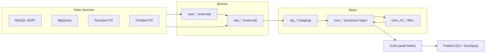

# Pipeline Architecture

## Overview

This project follows the **Medallion Architecture** (Bronze, Silver, Gold) extended
with a **Publish** layer for final delivery to external systems.

The processing paradigm is **ELT** (Extract-Load-Transform) rather than the
classic ETL:

1. **E**xtract — Bronze assets pull raw data from source systems.
2. **L**oad — Raw data is persisted to S3 before any transformation.
3. **T**ransform — Silver assets clean, normalize and apply business logic
   on the already-stored data.
4. **L** (final) — Publish assets load the finished Gold tables into the
   external destination (GeoSpot PostgreSQL, S3 CSV).

### Technology stack

| Component | Tool |
|-----------|------|
| Orchestrator | Dagster |
| Transformations | Polars |
| Intermediate storage | AWS S3 (Parquet / CSV) |
| Destination DB | GeoSpot PostgreSQL |
| Credentials | AWS SSM Parameter Store |

---

## Layers



### Bronze — Extraction

Bronze assets extract raw data from source systems. Each asset defines its SQL
query **inline** (queries never live in shared files). There are two sub-types:

#### `raw_*` (External)

Extract data from an external source and expose it to the Silver layer.
Every `raw_*` asset **must** have a corresponding `stg_*` asset (1:1 rule).

```
raw_s2p_clients       → reads from MySQL S2P table `clients`
raw_gs_lk_spots       → reads from GeoSpot table `lk_spots`
raw_bq_spot_events    → reads from BigQuery view
```

#### `rawi_*` (Internal)

Internal control assets that feed other Bronze assets but do **not** need a
corresponding STG. They handle pipeline control flow such as watermarks,
affected-ID detection, or run-ID generation.

```
rawi_gs_sst_watermark          → reads MAX(updated_at) and MAX(id) for incremental loading
rawi_s2p_sst_new_transitions   → detects new/edited records since watermark
```

#### Naming convention

```
raw_{source}_{table}
rawi_{source}_{table}
```

Source prefixes:

| Prefix | Source system |
|--------|-------------|
| `s2p_` | MySQL — Spot2 Platform (production) |
| `gs_`  | PostgreSQL — GeoSpot |
| `bq_`  | Google BigQuery |
| `cb_`  | PostgreSQL — Chatbot |

---

### Silver — Transformation

Silver is split into two sub-layers with distinct responsibilities.

#### STG (Staging / Interface)

Each `raw_*` asset has exactly one `stg_*` counterpart (mandatory 1:1
relationship). The STG asset is the **interface** between Bronze and the rest of
the pipeline.

**Allowed:**

- Type normalization and casting to canonical schemas.
- Data cleaning (nulls, duplicates, formatting).
- Calculated fields derived **exclusively from its own RAW** — for example
  `next_run_id = max_run_id + 1` from `raw_gs_effective_supply_run_id`.

**Forbidden:**

- Joins with other STG or RAW assets.
- Database queries or any I/O.
- Use of data from any source other than its own RAW.

```
stg_s2p_clients       → normalizes types from raw_s2p_clients
stg_gs_lk_spots       → normalizes types from raw_gs_lk_spots
stg_gs_run_id         → computes next run_id from raw_gs_run_id
```

#### Core (Business Logic)

Core assets implement all business logic: joins, aggregations, calculations and
enrichments. They read **only** from STG assets or from other Core assets — never
from Bronze or external sources.

**Allowed:**

- Joins across multiple STG assets.
- Complex aggregations and window functions.
- Business rule application.

**Forbidden:**

- Database queries or any I/O.
- Direct reads from Bronze assets.

```
core_effective_supply_events   → UNION of multiple STG event sources
core_sst_rebuild_history       → combines STG history + STG snapshots, dedup, enrichment
```

##### Core ML (`core/ml/`)

For pipelines that include Machine Learning, the ML sub-pipeline lives inside
`silver/core/ml/`. These assets follow the same rules as regular Core assets
(no I/O, reads from STG or Core only) but are organized in a dedicated
sub-directory with their own `constants.py` for tunable parameters.

Typical ML flow:

```
core_ml_build_universes      → separates populations (e.g. rent vs sale)
core_ml_feature_engineering  → encoding, log transforms, binning
core_ml_train                → model training with QA gates and fallback cascade
core_ml_score                → propensity scoring on full population
core_ml_drivers              → permutation importance
core_ml_category_effects     → lift per feature value
core_ml_rules                → hierarchical interpretable rules
```

---

### Gold — Delivery Preparation

Gold assets receive from Core and prepare data for final delivery. Their only
responsibility is adding **audit fields** — they contain no heavy business logic.

Fields added at this layer:

| Field | Description |
|-------|-------------|
| `aud_run_id` | Execution run identifier (renamed from `run_id` in Core). **Only for append-mode tables** where each run inserts a new chunk without overwriting previous data (e.g. `lk_effective_supply`). For replace/upsert tables this field is omitted, as the entire table is rewritten on each run. |
| `aud_inserted_at` | Timestamp of insertion |
| `aud_inserted_date` | Date of insertion |
| `aud_updated_at` | Timestamp of last update |
| `aud_updated_date` | Date of last update |
| `aud_job` | Name of the job that produced the record |

Gold may also add lightweight flags that depend on external reference data
(e.g. hard-delete detection by comparing against active spot IDs).

---

### Publish — Final Load

Publish assets take Gold tables and load them into external destinations.
They perform **no transformations** — only I/O.

Each table typically produces two assets:

```
lk_effective_supply_to_s3       → writes to S3
lk_effective_supply_to_geospot  → loads from S3 into GeoSpot PostgreSQL via API
```

The `_to_geospot` asset depends on `_to_s3` to ensure data is persisted before
loading into the database.

#### File format: Parquet vs CSV

| Criterion | Parquet | CSV |
|-----------|---------|-----|
| Compression | Snappy (~3 MB for 150K rows) | None (~28 MB for 150K rows) |
| GeoSpot large-table support | Reliable for 150K+ rows | May truncate due to file-size/timeout limits |
| Boolean columns | Native `Boolean` — no casting needed | Must cast to `Int8` (0/1) before writing |
| Type safety | Schema embedded in file | No schema; types inferred by loader |

**Parquet is the preferred format for tables with more than ~50K rows.** Smaller
tables may use CSV for simplicity (legacy flows still do).

#### Functions and usage

| Function | Format | Use case |
|----------|--------|----------|
| `write_polars_to_s3(df, key, ctx, file_format="parquet")` | Parquet | Default for new flows and heavy tables |
| `write_polars_to_s3(df, key, ctx, file_format="csv")` | CSV | Small tables or legacy flows |
| `write_polars_to_s3_csv_chunked(df, key, ctx)` | CSV | Multi-part upload for very large CSVs (legacy) |
| `load_to_geospot(s3_key, table, mode, ctx)` | Any | Loads from S3 into GeoSpot PostgreSQL (format-agnostic) |

All functions are exported from `data_lakehouse.shared` and re-exported by
each flow's `shared.py`.

#### Type alignment for Parquet loads

When loading Parquet into GeoSpot, the Parquet schema **must match the
PostgreSQL DDL exactly**. Polars aggregation functions produce types that may
not align with the target DDL (e.g. `len()` → `UInt32`, `sum()` → `Int64`),
so explicit casting is required in the Publish layer:

```python
_PG_TYPE_OVERRIDES: dict[str, pl.DataType] = {
    "total_sessions":   pl.Int32,   # UInt32 (len)      → INTEGER
    "total_page_views": pl.Int32,   # Int64  (sum)      → INTEGER
    "days_active":      pl.Int32,   # UInt32 (n_unique)  → INTEGER
}

cast_exprs = [
    pl.col(c).cast(t) for c, t in _PG_TYPE_OVERRIDES.items()
    if c in df.columns
]
df_out = df.with_columns(cast_exprs) if cast_exprs else df
```

Common Polars → PostgreSQL mappings:

| Polars type | PostgreSQL type | Notes |
|-------------|----------------|-------|
| `Int32` | `INTEGER` | Cast from `UInt32`/`Int64` if needed |
| `Int64` | `BIGINT` | Direct match |
| `Boolean` | `BOOLEAN` | Direct match (no casting needed in Parquet) |
| `String` | `VARCHAR(n)` / `TEXT` | Direct match |
| `Date` | `DATE` | Direct match |
| `Datetime(μs)` | `TIMESTAMP` | Direct match |

**Important:** `NOT NULL` constraints in the DDL will cause partial loads if
any row contains a null in that column — the GeoSpot COPY aborts the current
batch silently. Ensure upstream logic filters or fills nulls for constrained
columns.

---

## Directory Structure

Each pipeline flow follows this standard layout:

```
defs/{flow_name}/
├── __init__.py          # Exports all assets, jobs, schedules
├── shared.py            # Re-exports helpers from data_lakehouse.shared
├── jobs.py              # Job definitions and schedules
│
├── bronze/
│   ├── __init__.py
│   ├── rawi_*.py        # Internal bronze assets
│   └── raw_*.py         # External bronze assets
│
├── silver/
│   ├── __init__.py
│   ├── silver_shared.py  # Shared transformation functions (optional, see below)
│   ├── stg/
│   │   ├── __init__.py
│   │   └── stg_*.py     # Staging assets (1:1 with raw_*)
│   └── core/
│       ├── __init__.py
│       ├── core_*.py    # Business logic assets
│       └── ml/          # ML sub-pipeline (optional)
│           ├── __init__.py
│           ├── constants.py
│           └── core_ml_*.py
│
├── gold/
│   ├── __init__.py
│   └── gold_*.py        # Audit-enriched assets
│
└── publish/
    ├── __init__.py
    └── *.py             # S3 + GeoSpot load assets
```

### Shared files

| File | Contents |
|------|----------|
| `shared.py` | Re-exports `query_bronze_source`, `write_polars_to_s3`, `build_gold_s3_key`, `load_to_geospot` from `data_lakehouse.shared` |
| `silver/silver_shared.py` | Shared transformation functions and constants used by 2+ Core assets (optional, see design rules below). |
| `constants.py` | Tunable parameters for ML pipelines (hyperparameters, feature lists, thresholds). |
| `jobs.py` | Job definitions (`AssetSelection`), cron schedules, and `cleanup_storage` inclusion. Every job selection must include `cleanup_storage` at the end. |

---

## Naming Conventions

### Asset names

```
{layer}_{source}_{descriptive_name}
```

| Layer | Prefix | Example |
|-------|--------|---------|
| Bronze external | `raw_` | `raw_s2p_clients` |
| Bronze internal | `rawi_` | `rawi_gs_sst_watermark` |
| STG | `stg_` | `stg_s2p_clients` |
| Core | `core_` | `core_effective_supply` |
| Core ML | `core_ml_` | `core_ml_train` |
| Gold | `gold_` | `gold_lk_effective_supply` |
| Publish | (table name) | `lk_effective_supply_to_s3` |

### Traceability rule for Bronze and STG

The `{table}` component in `raw_{source}_{table}` **must match** the original
table name in the source system. This allows identifying the source table at a
glance without inspecting the code.

```
raw_gs_lk_leads         → reads from GeoSpot table `lk_leads`      ✔ names match
raw_s2p_clients         → reads from MySQL table `clients`          ✔ names match
```

The corresponding `stg_*` inherits the same table name by default. In
exceptional cases where the business has adopted a different name, the STG may
rename it (e.g., `stg_s2p_clients` became `stg_s2p_leads` because the entity
was renamed from "clients" to "leads" across the platform).

### GeoSpot table names

| Prefix | Meaning |
|--------|---------|
| `lk_` | Lakehouse table (single-entity) |
| `bt_` | Bridge table (many-to-many relationship) |
| `rpt_` | Reporting table (derived metrics, dashboards) |

### Asset group names

Every asset must set `group_name` in its `@dg.asset` decorator to organize
the Dagster graph visually. The convention is `{flow_abbreviation}_{layer}`:

```
{flow_abbrev}_{layer}
```

| Flow | Abbreviation | Example groups |
|------|-------------|----------------|
| Data Lakehouse | _(generic)_ | `bronze`, `silver`, `gold`, `publish` |
| Effective Supply | `effective_supply` | `effective_supply_bronze`, `effective_supply_silver` |
| Spot State Transitions | `sst` | `sst_bronze`, `sst_silver`, `sst_gold` |
| Funnel PTD | `funnel_ptd` | `funnel_ptd_bronze`, `funnel_ptd_stg`, `funnel_ptd_core` |
| Spot Amenities | `spa` | `spa_bronze`, `spa_silver`, `spa_gold`, `spa_publish` |

Data Lakehouse uses generic layer names because it was the first flow and
will be deprecated. All subsequent flows **must** use the prefixed convention.

---

## Design Rules (Summary)

1. **Each layer reads only from the layer immediately below.**
   Bronze reads from sources; STG reads from its own RAW; Core reads from STG
   or Core; Gold reads from Core; Publish reads from Gold.

2. **SQL queries live exclusively in Bronze.**
   No other layer executes database queries. All downstream layers work with
   in-memory DataFrames.

3. **STG is a 1:1 interface with its RAW.**
   One STG per external RAW. It can normalize, clean and add calculated fields
   from its own RAW only. No joins, no external data.

4. **Core is pure transformation (no I/O).**
   All business logic happens here. Functions are deterministic and testable.

5. **Gold only prepares for delivery.**
   Adds audit fields (`aud_*`). No heavy logic.

6. **Publish only loads to destinations.**
   Writes to S3 and/or GeoSpot. No transformations.

7. **Internal Bronze (`rawi_*`) does not need a STG.**
   These are pipeline-control assets that feed other Bronze assets, not the
   Silver layer directly.

8. **Single Responsibility Principle (SOLID).**
   Each Core asset **must own all of its transformation logic**. Functions,
   constants and helper routines that are consumed by a single asset must live
   inside that asset's file — never in a shared module. This makes each asset
   self-contained, easy to test in isolation and simple to reason about.

9. **Shared transformation files are the exception, not the rule.**
   A `silver/silver_shared.py` file is justified **only** when a function or
   constant is genuinely reused by 2 or more Core assets. Even then, it must
   remain minimal: only the strictly shared code belongs there. If a function
   is later consumed by a single asset only, it must be moved into that asset.
   Shared files live inside `silver/` because transformations happen
   exclusively in that layer — Bronze and Gold do not produce shared
   transformation logic.

10. **Every job must include `cleanup_storage` as its final step.**
    Dagster persists intermediate DataFrames as pickle files in the `storage/`
    directory. Without cleanup, disk usage grows unboundedly and causes I/O
    errors. Every job selection must append
    `| dg.AssetSelection.assets("cleanup_storage")` to ensure these files are
    deleted after the pipeline completes.

11. **Every asset must use the `iter_job_wrapped_compute` wrapper.**
    All assets that participate in monitored jobs must wrap their logic using
    `iter_job_wrapped_compute` from `defs/pipeline_asset_error_handling.py`.
    This standardizes error metadata emission and enables failure notifications.
    See the [Error Handling](#error-handling-and-failure-notifications) section
    for details.

12. **Every job that publishes to GeoSpot must be registered for failure
    notifications.**
    Add the job to `LAKEHOUSE_NEW_PIPELINE_JOBS` in `defs/data_lakehouse/jobs.py`
    so the `lakehouse_new_pipeline_failure_chat` sensor monitors it and sends
    alerts to the Google Chat `data-lake-errors` channel on failure.

---

## Error Handling and Failure Notifications

### Asset error wrapper (`iter_job_wrapped_compute`)

All assets use a standardized error handling wrapper defined in
`defs/pipeline_asset_error_handling.py`. The wrapper:

1. Executes the asset logic inside a `try/except`.
2. On success, yields `dg.Output(result)`.
3. On failure, emits a `MaterializeResult` with error metadata (`error_type`,
   `error_message`, `asset_key`, `partition_key`) and re-raises the exception.

**Pattern for assets created with `make_bronze_asset`:**

The wrapper is applied automatically inside `bronze/base.py._build_asset`.
No additional code is needed.

**Pattern for custom `@dg.asset` definitions:**

```python
from dagster_pipeline.defs.pipeline_asset_error_handling import iter_job_wrapped_compute

@dg.asset(name="my_asset", ...)
def my_asset(context):
    def body():
        # all logic here
        return result

    yield from iter_job_wrapped_compute(context, body)
```

**Pattern for complex assets with separate `_impl` functions:**

For large assets (e.g. `gold_bt_lds_lead_spots_new`), extract the logic into
a `_my_asset_impl(context)` function and call it from `body()`:

```python
def _my_asset_impl(context: dg.AssetExecutionContext) -> pl.DataFrame:
    # all logic here
    return df

@dg.asset(name="my_asset", ...)
def my_asset(context):
    def body():
        return _my_asset_impl(context)

    yield from iter_job_wrapped_compute(context, body)
```

### Failure notification sensor

The sensor `lakehouse_new_pipeline_failure_chat` monitors all jobs registered
in `LAKEHOUSE_NEW_PIPELINE_JOBS` (defined in `defs/data_lakehouse/jobs.py`).
When a monitored job fails, the sensor sends a summary to Google Chat:

- **Channel:** `data-lake-errors`
- **Webhook:** Resolved from env var `DAGSTER_LAKEHOUSE_FAILURE_WEBHOOK_URL`
  or SSM parameter `/dagster/data-lake-errors/google_chat_webhook`
- **Content:** Job name, run ID, partition key, and a compact error summary
  (leaf cause without Dagster stack traces)

**Registering a new job:**

Add the job object to the `LAKEHOUSE_NEW_PIPELINE_JOBS` tuple in
`defs/data_lakehouse/jobs.py`. The sensor picks it up automatically.

---

## Implemented Flows

| Flow | Directory | Description | Schedule |
|------|-----------|-------------|----------|
| Data Lakehouse | `defs/data_lakehouse/` | Core business tables (leads, projects, spots, users, conversations, transactions) | Daily (bronze 01:00-03:00, silver/gold chained via `per_gold_chain_sensor`) |
| Effective Supply | `defs/effective_supply/` | Demand-weighted supply relevance with ML scoring, rules and category effects (6 tables) | Monthly (12:00 PM, 1st of month) |
| Spot State Transitions | `defs/spot_state_transitions/` | Incremental history of spot status changes with dual-watermark extraction | Daily (9:00 AM) |
| Conversation Analysis | `defs/conversation_analysis/` | Extracts and merges conversations with clients for analysis | Hourly (9-18) + daily (4:00 AM) |
| Visitors to Leads | `defs/visitors_to_leads/` | Matches site visitors with lead events | Daily (8:00 AM) |
| LK Matches VTL | `defs/lk_matches_visitors_to_leads/` | Independent VTL pipeline writing to GeoSpot | Daily (8:45 AM) |
| LK Visitors | `defs/lk_visitors/` | Funnel with channel data from BigQuery | Daily (4:00 AM, STOPPED) |
| Funnel PTD | `defs/funnel_ptd/` | Period-to-date funnel monitor with forecasting | Sensor (`funnel_ptd_after_gold_sensor`, triggered after gold leads + projects) |
| Maintenance | `defs/maintenance/` | Daily cleanup of storage files and completed runs | Daily (11:00 PM) |
| Spot Amenities | `defs/spot_amenities/` | Bridge table: spots and their amenities with category classification | Daily (5:00 AM) |
| Amenity Description Consistency | `defs/amenity_description_consistency/` | Detects tagged amenities omitted from AI-generated spot descriptions | Sensor (`adc_after_spot_amenities_sensor`, triggered after `spot_amenities_job`) |
| Observability | `defs/observability/` | Traffic anomaly alerts | Daily (8:45 AM) |
| Browse Visitors | `defs/browse_visitors/` | Browse-page visitor metrics with conversion flag (Parquet, 150K+ rows) | Daily (10:00 AM) |

All schedules use timezone `America/Mexico_City`.
