# Entidades Principales - Spot2

---

## 🔐 ⚠️ Política de Privacidad - IMPORTANTE

**NUNCA EXPONER EN DOCUMENTACIÓN O DASHBOARDS PÚBLICOS**:

| Tipo de Dato | Ejemplos | Estado |
|--------------|----------|--------|
| **Teléfono** | lead_phone_number, user_phone | 🔴 SENSIBLE |
| **Email** | user_email, lead_email | 🔴 SENSIBLE |
| **Dirección exacta** | spot_address, settlement detallados | 🔴 SENSIBLE |
| **Nombres personales** | user_name, lead_name | 🔴 SENSIBLE |
| **Transcripciones chatbot** | conv_text con datos del usuario | 🔴 SENSIBLE |
| **IDs sin hash** | user_pseudo_id sin anonimizar | 🟡 CUIDADO |

**Cómo Manejar Datos Sensibles**:
- ✅ Usar placeholders `[REDACTED]`, `[email_placeholder]` en ejemplos
- ✅ Hashear IDs de usuarios: `****12345`
- ✅ Documentar campos sensibles pero sin valores reales
- ✅ Aplicar LGPD/GDPR compliance en todas las queries
- ✅ Auditar accesos a datos sensibles

---

## 📊 Diagrama de Relaciones (ERD) - 11 Tablas Golden + Audit

```mermaid
erDiagram
%% =======================================================
%% TABLAS GOLDEN - 11 ENTIDADES COMPLETAS
%% =======================================================

%% ----------------------------
%% LOOKUP TABLES (Catálogos/Maestros)
%% ----------------------------

%% Tabla 1: lk_leads
lk_leads {
    int lead_id PK "Identificador único del Lead"
    string lead_type "Clasificación: L0, L1, L2, L3, L4"
    int lead_l0 "Indicador: Creación de cuenta"
    int lead_l1 "Indicador: Landing profiling"
    int lead_l2 "Indicador: Spot Interested"
    int lead_l3 "Indicador: Outbound contact"
    int lead_l4 "Indicador: Treble source"
    int lead_supply "1=Supply, 0=Demand"
    string lead_domain "Dominio email (ej: gmail.com)"
    string spot_sector "Sector buscado (Office, Retail, etc)"
    datetime lead_created_date "Fecha de creación"
    datetime lead_deleted_at "Soft delete (NULL si activo)"
    timestamp aud_insert_at "Timestamp inserción original"
    timestamp aud_update_at "Timestamp última actualización"
    string aud_job "Job Dagster responsable"
}

%% Tabla 2: lk_projects
lk_projects {
    int project_id PK "Identificador único del proyecto"
    int lead_id FK "Referencia a lk_leads.lead_id"
    string project_status "Estado: Current, Closed, etc"
    datetime project_created_at "Fecha de creación"
    datetime project_funnel_visit_created_date "Visita solicitada"
    datetime project_funnel_visit_confirmed_at "Visita confirmada"
    datetime project_funnel_visit_realized_at "Visita realizada"
    datetime project_funnel_loi_date "LOI emitida"
    datetime project_funnel_contract_date "Contrato firmado"
    datetime project_won_date "Deal cerrado"
    timestamp aud_insert_at "Timestamp inserción"
    timestamp aud_update_at "Timestamp actualización"
    string aud_job "Job Dagster"
}

%% Tabla 3: lk_spots
lk_spots {
    int spot_id PK "Identificador único del spot/propiedad"
    string spot_title "Título de publicación"
    string spot_type "Tipo: Subspace, Single, Complex"
    string spot_status_full "Estado: Public, Disabled, etc"
    string spot_origin "Origen: Spot2, EasyBroker, NocNok"
    string spot_sector "Sector: Office, Retail, Industrial, etc"
    string spot_state "Estado geográfico (ej: México)"
    string spot_municipality "Municipio"
    string spot_settlement "Asentamiento/Colonia"
    datetime spot_created_at "Fecha de publicación"
    datetime spot_deleted_at "Soft delete (NULL si activo)"
    timestamp aud_insert_at "Timestamp inserción"
    timestamp aud_update_at "Timestamp actualización"
    string aud_job "Job Dagster"
}

%% Tabla 4: lk_users
lk_users {
    int user_id PK "Identificador único del usuario registrado"
    string user_email "Email (PII - dato sensible)"
    string user_name "Nombre (PII - dato sensible)"
    string user_role "Rol: Supply, Demand, Internal"
    datetime user_registration_date "Fecha de registro"
    int user_supply "1=Supply, 0=Demand"
    datetime user_deleted_at "Soft delete (NULL si activo)"
    timestamp aud_insert_at "Timestamp inserción"
    timestamp aud_update_at "Timestamp actualización"
    string aud_job "Job Dagster"
}

%% Tabla 5: lk_leads_matches
lk_leads_matches {
    string user_pseudo_id PK "ID pseudoaletoreo del visitor (GA4)"
    int lead_id PK "Referencia a lk_leads.lead_id"
    int spot_id PK "Referencia a lk_spots.spot_id"
    int project_id FK "Referencia a lk_projects (opcional)"
    string match_type "Tipo: Search, System, Manual"
    float match_relevance_score "Score 0-100 de relevancia"
    float match_confidence_score "Confianza 0-1.0 del algoritmo"
    datetime match_created_date "Fecha creación del match"
    timestamp aud_insert_at "Timestamp inserción"
    timestamp aud_update_at "Timestamp actualización"
    string aud_job "Job Dagster"
}

%% Tabla 6: lk_okrs
lk_okrs {
    timestamp okr_month_start_ts PK "Inicio del mes (ej: Feb 1, 2026)"
    int okr_leads "Target: Nuevos leads esperados"
    int okr_projects "Target: Nuevos proyectos"
    int okr_scheduled_visits "Target: Visitas agendadas"
    int okr_confirmed_visits "Target: Visitas confirmadas"
    int okr_completed_visits "Target: Visitas completadas"
    int okr_lois "Target: LOIs emitidas"
}

%% ----------------------------
%% BEHAVIORAL/FACT TABLES (Eventos)
%% ----------------------------

%% Tabla 7: bt_con_conversations
bt_con_conversations {
    string conv_id PK "Identificador único de conversación"
    string user_pseudo_id FK "Referencia a visitor (GA4)"
    int lead_id FK "Referencia a lk_leads.lead_id (opcional)"
    int spot_id FK "Referencia a lk_spots.spot_id"
    datetime conv_start_date "Inicio de conversación"
    datetime conv_end_date "Fin de conversación"
    int conv_messages "Total mensajes intercambiados"
    string conv_text "Transcripción (PII - sensible)"
    string funnel_type "Tipo: recommendation_scheduling, etc"
    float total_time_conversation "Duración en horas"
    timestamp aud_insert_at "Timestamp inserción"
    timestamp aud_update_at "Timestamp actualización"
    string aud_job "Job Dagster"
}

%% Tabla 8: bt_lds_lead_spots
bt_lds_lead_spots {
    string lds_id PK "ID único del evento lead-spot"
    int lead_id FK "Referencia a lk_leads.lead_id"
    int spot_id FK "Referencia a lk_spots.spot_id"
    int user_id FK "Referencia a lk_users (broker, opcional)"
    int project_id FK "Referencia a lk_projects (opcional)"
    string match_id FK "Referencia a lk_leads_matches.match_id (opcional)"
    string lds_event_type "Tipo: View, Favorite, Inquiry, Visit, Comparison, Share"
    datetime lds_event_timestamp "Fecha/hora exacta del evento"
    datetime lds_event_date "Fecha del evento (para agregación)"
    string lds_event_source "Origen: Web, Mobile App, Email, Admin"
    string lds_event_device_type "Dispositivo: Desktop, Mobile, Tablet"
    timestamp aud_insert_at "Timestamp inserción"
    timestamp aud_update_at "Timestamp actualización"
    string aud_job "Job Dagster"
}

%% Tabla 9: bt_transactions
bt_transactions {
    int transaction_id PK "Identificador único de transacción"
    int user_id FK "Referencia a lk_users.user_id"
    int project_id FK "Referencia a lk_projects.project_id"
    int lead_id FK "Referencia a lk_leads.lead_id"
    int spot_id FK "Referencia a lk_spots.spot_id"
    float transaction_amount "Monto de la transacción"
    datetime transaction_date "Fecha de cierre"
    string transaction_status "Estado: Completed, Pending, Cancelled"
    timestamp aud_insert_at "Timestamp inserción"
    timestamp aud_update_at "Timestamp actualización"
    string aud_job "Job Dagster"
}

%% ----------------------------
%% MAPPING/BRIDGE TABLES (Relaciones N:M)
%% ----------------------------

%% Tabla 10: Bridge - Projects_Spots (N:M)
lk_projects_spots {
    int project_id PK "Referencia a lk_projects.project_id"
    int spot_id PK "Referencia a lk_spots.spot_id"
    datetime assignation_date "Fecha de asignación al proyecto"
    timestamp aud_insert_at "Timestamp inserción"
    timestamp aud_update_at "Timestamp actualización"
    string aud_job "Job Dagster"
}

%% Tabla 11: DIM - Visitors (Pseudo-anonimizado)
lk_visitors {
    string user_pseudo_id PK "ID pseudo de GA4 (hash)"
    datetime vis_first_visit_date "Fecha primer acceso"
    string vis_source "Fuente: google, facebook, direct, etc"
    string vis_medium "Medio: cpc, organic, email, etc"
    string vis_campaign_name "Nombre de campaña"
    string vis_channel "Channel: Paid Search, Organic, etc"
    string vis_traffic_type "Tipo: Paid, Organic"
    string device_info "Info dispositivo"
    timestamp aud_insert_at "Timestamp inserción"
    timestamp aud_update_at "Timestamp actualización"
    string aud_job "Job Dagster"
}

%% =======================================================
%% RELACIONES (One-to-Many, Many-to-Many, etc)
%% =======================================================

%% Visitors → Conversations
lk_visitors ||--o{ bt_con_conversations : "inicia_conversacion"

%% Leads ← Visitors (mapping)
lk_visitors ||--o{ lk_leads_matches : "mapea_a"
lk_leads_matches }o--|| lk_leads : "referencia"

%% Leads → Projects (1:N)
lk_leads ||--o{ lk_projects : "crea"

%% Leads → Lead_Spots (1:N)
lk_leads ||--o{ bt_lds_lead_spots : "interactua_con_spots"

%% Projects → Spots (N:M via bridge)
lk_projects ||--|{ lk_projects_spots : "contiene"
lk_spots ||--|{ lk_projects_spots : "es_parte_de"

%% Spots → Conversations
lk_spots ||--o{ bt_con_conversations : "es_tema_de"

%% Spots → Lead_Spots
lk_spots ||--o{ bt_lds_lead_spots : "es_interactuada_por_leads"

%% Leads → Conversations
lk_leads ||--o{ bt_con_conversations : "participa_en"

%% Users → Transactions
lk_users ||--o{ bt_transactions : "realiza"

%% Projects → Transactions
lk_projects ||--o{ bt_transactions : "genera"

%% Spots → Transactions
lk_spots ||--o{ bt_transactions : "es_objeto_de"

%% Users → Lead_Spots (broker/agente)
lk_users ||--o{ bt_lds_lead_spots : "facilita"

%% Projects → Lead_Spots
lk_projects ||--o{ bt_lds_lead_spots : "asocia_con"

%% Leads → Matches (N:1)
lk_leads ||--o{ lk_leads_matches : "tiene_matches"
```



---

## 📖 Leyenda del ERD - Tipos de Tablas

### Componentes del Diagrama

**🟢 LOOKUP TABLES (LK_*)** - Catálogos/Maestros
- `lk_leads`: Todos los leads identificados (L0-L4)
- `lk_projects`: Requerimientos/búsquedas de leads
- `lk_spots`: Catálogo de propiedades publicadas
- `lk_users`: Usuarios registrados (supply/demand/internal)
- `lk_leads_matches`: Recomendaciones lead-spot (matching engine)
- `lk_okrs`: Targets mensuales definidos por negocio
- `lk_visitors`: Visitantes anónimos (GA4)

**🔴 BEHAVIORAL/FACT TABLES (BT_*)** - Eventos/Transacciones
- `bt_con_conversations`: Diálogos chatbot
- `bt_lds_lead_spots`: Interacciones lead-spot (view, favorite, inquiry, visit)
- `bt_transactions`: Deals cerrados

**🔵 BRIDGE TABLES** - Relaciones N:M
- `lk_projects_spots`: Proyecto ↔ Spot (N:M)
- (Nota: `lk_leads_matches` también es bridge: Visitor ↔ Lead ↔ Spot)

### Cardinalidades en el Diagrama

- `||--||` : One-to-One (1:1)
- `||--o{` : One-to-Many (1:N)
- `}o--||` : Many-to-One (N:1)
- `||--|{` : Many-to-Many (N:M, con bridge table)

### Tabla Resumen - 11 Tablas Golden Completas

| # | Tabla | Tipo | PK | Registros | Descripción |
|---|-------|------|----|-----------|----|
| 1 | **lk_leads** | Lookup | lead_id | Thousands | Catálogo de leads (L0-L4) |
| 2 | **lk_projects** | Lookup | project_id | Thousands | Requerimientos/búsquedas de leads |
| 3 | **lk_spots** | Lookup | spot_id | Thousands | Catálogo de propiedades |
| 4 | **lk_users** | Lookup | user_id | Tens of thousands | Usuarios registrados (supply/demand) |
| 5 | **lk_leads_matches** | Bridge/Mapping | (user_pseudo_id, lead_id, spot_id) | Tens of thousands | Recomendaciones lead-spot |
| 6 | **lk_okrs** | Lookup | okr_month_start_ts | Monthly targets | Targets mensuales |
| 7 | **lk_visitors** | Lookup | user_pseudo_id | Tens of thousands+ | Visitantes anónimos (GA4) |
| 8 | **bt_con_conversations** | Behavioral | conv_id | Thousands | Diálogos chatbot |
| 9 | **bt_lds_lead_spots** | Behavioral | lds_id | Tens of thousands | Interacciones lead-spot |
| 10 | **bt_transactions** | Behavioral | transaction_id | Hundreds | Deals cerrados |
| 11 | **lk_projects_spots** | Bridge | (project_id, spot_id) | Thousands+ | Proyecto ↔ Spot (N:M) |

---

## 1. Leads (Usuarios - Demanda/Supply)

### Definición
Un **lead** es un usuario que se ha registrado en Spot2 o ha interactuado con la plataforma. Puede ser de **demanda** (buscando rentar/comprar espacios) o de **supply** (queriendo publicar sus propiedades).

### Características Principales

- **Identificador**: `lead_id` (UUID/INT único)
- **Creación**: `lead_created_date` (cuándo se registró)
- **Eliminación lógica**: `lead_deleted_at` (NULL si activo)
- **Dominio**: `lead_domain` (origen, ej: gmail.com, empresa.com)
- **Sector buscado**: `spot_sector` (Office, Retail, Industrial, Land, Mixed Use)

### Adquisición - Cómo llegó el Lead (L0-L4)

Los campos `lead_l0` a `lead_l4` indican por qué medio se adquirió el lead:

```
lead_l0 = 1: Creación de cuenta - El lead se registró
lead_l1 = 1: Landing profiling, consultoría o click en modal 100 segundos - Completó formulario de requerimientos
lead_l2 = 1: Spot Interested - Expresó interés en un espacio
lead_l3 = 1: Outbound contact - Lead contactado proactivamente por ventas
lead_l4 = 1: Treble source - Lead originado desde Trebble
```

**Nota**: Un lead puede tener múltiples flags = 1 (múltiples canales de adquisición)

### Tipo de Lead

- **`lead_supply = 1`**: Es un lead de OFERTA (quiere publicar/vender espacios)
- **`lead_supply = 0`**: Es un lead de DEMANDA (quiere rentar/comprar espacios)

### Timestamps de Progresión

```
lead_lead0_at: Fecha creación
lead_lead1_at: Fecha de landing click
lead_lead2_at: Fecha de contacto en detalle
lead_lead3_at: Fecha de contacto outbound
lead_lead4_at: Fecha de otro evento
```

### Ejemplo de Lead (Demanda)

```json
{
  "lead_id": "****15812",
  "lead_domain": "[domain_placeholder]",
  "spot_sector": "Office",
  "lead_created_date": "2025-01-15",
  "lead_supply": 0,
  "lead_l0": 1,
  "lead_l1": 1,
  "lead_l2": 1,
  "lead_l3": 0,
  "lead_l4": 0,
  "lead_lead0_at": "2025-01-15 10:00:00",
  "lead_lead1_at": "2025-01-18 14:15:00",
  "lead_lead2_at": "2025-01-15 14:15:00",
  "lead_lead3_at": null,
  "lead_lead4_at": null,
  "lead_deleted_at": null
}
```

### Ejemplo de Lead (Supply)

```json
{
  "lead_id": "****28945",
  "lead_domain": "[domain_placeholder]",
  "spot_sector": "Office",
  "lead_created_date": "2025-02-01",
  "lead_supply": 1,
  "lead_l0": 1,
  "lead_l1": 0,
  "lead_l2": 0,
  "lead_l3": 1,
  "lead_l4": 0,
  "lead_lead0_at": "2025-02-01 09:30:00",
  "lead_lead3_at": "2025-02-03 11:00:00",
  "lead_deleted_at": null
}
```

---

## 2. Projects (Requerimientos)

### Definición
Un **project** es un requerimiento de búsqueda que un lead abre. Es la unidad de transacción en Spot2. Un lead puede tener múltiples proyectos simultáneamente.

### Características Principales

- **Identificador**: `project_id` (UUID/INT único)
- **Lead propietario**: `lead_id` (FK → LK_LEADS)
- **Creación**: `project_created_at` (fecha de apertura del requerimiento)
- **Estado**: `project_status` (Current, Closed, etc)

### Funnel/Ciclo de Vida del Proyecto

```
Created (Fecha de requerimiento abierto)
    ↓
Visit Requested (project_funnel_visit_created_date)
    ↓
Visit Confirmed (project_funnel_visit_confirmed_at)
    ↓
Visit Realized (project_funnel_visit_realized_at)
    ↓
LOI (project_funnel_loi_date) - Carta de Intención
    ↓
Contract (project_funnel_contract_date)
    ↓
Won (project_won_date) - Transacción cerrada
```

### Campos Principales

```sql
-- Instantes clave del funnel
project_funnel_visit_created_date    -- Cuándo se solicitó visita
project_funnel_visit_confirmed_at    -- Cuándo se confirmó la visita
project_funnel_visit_realized_at     -- Cuándo se realizó la visita
project_funnel_loi_date              -- Cuándo se emitió LOI
project_funnel_contract_date         -- Cuándo se firmó contrato
project_won_date                     -- Cuándo se cerró el deal
```

### Métricas Derivadas

```sql
-- Velocidad (días entre etapas)
Days to Visit Request = visit_created_date - project_created_at
Days Visit to LOI = loi_date - visit_realized_at
Days LOI to Contract = contract_date - loi_date

-- Conversión
Visit Realized vs Requested = visits_realized / visits_requested
LOI vs Visits Realized = loi_count / visits_realized
Won Rate = won_count / total_projects
```

### Ejemplo de Project

```json
{
  "project_id": "25065",
  "lead_id": "63402",
  "project_created_at": "2025-02-08 11:00:00",
  "project_status": "Current",
  "project_funnel_visit_created_date": "2025-02-08 11:15:00",
  "project_funnel_visit_confirmed_at": "2025-02-10 12:15:00",
  "project_funnel_visit_realized_at": "2025-02-12 13:15:00",
  "project_funnel_loi_date": "2025-02-28 12:25:00",
  "project_funnel_contract_date": null,
  "project_won_date": null
}
```

---

## 3. Visitors (Visitantes Anónimos)

### Definición
Un **visitor** es un usuario anónimo que visita Spot2.mx pero aún no se ha convertido en Lead registrado.

### Características Principales

- **Identificador**: `user_pseudo_id` (seudo-anonimizado, ej: "860188043.1757558455")
- **Primera visita**: `vis_create_date` (cuándo llegó por primera vez)
- **Device**: `device_info` (dispositivo usado)

### Atributos de Adquisición (Source/Medium/Channel)

```
vis_source        - Fuente (google, facebook, direct, etc)
vis_medium        - Medio (cpc, organic, email, etc)
vis_campaign_name - Nombre de campaña (MOFU_MRC_GADS_SRCH_LDS)
vis_channel       - Channel (Paid Search, Organic Search, etc)
vis_traffic_type  - Tipo de tráfico (Paid, Organic)
```

### Ejemplo de Visitor

```json
{
  "user_pseudo_id": "[pseudo_id_hash]",
  "vis_create_date": "2025-02-08",
  "vis_source": "google",
  "vis_medium": "cpc",
  "vis_campaign_name": "MOFU_MRC_GADS_SRCH_LDS",
  "vis_channel": "Paid Search",
  "vis_traffic_type": "Paid"
}
```

**Nota**: `user_pseudo_id` es una identificación hash/seudo-anonimizada que protege la privacidad del visitante

### Funnel: Visitor → Lead → User

```
Visitor (anónimo)
    ↓ (interactúa)
BT_CONVERSATION (chatbot)
    ↓ (proporciona info)
Lead (se registra/se identifica)
    ↓ (crea cuenta formal)
User (usuario registrado)
```

---

## 4. Spots (Propiedades)

### Definición
Un **spot** es una propiedad inmobiliaria disponible en la plataforma. Puede ser ofertada por supply o buscada por demand.

### Características Principales

- **Identificador**: `spot_id` (UUID/INT único)
- **Título**: `spot_title` (nombre/descripción de la publicación)
- **Creación**: `spot_created_at` (fecha de publicación)
- **Eliminación lógica**: `spot_deleted_at` (NULL si activo)

### Clasificación

**Tipo de Spot** (`spot_type`):
```
Subspace    - Propiedad individual rentable/vendible ✅
Single      - Propiedad única rentable/vendible ✅
Complex     - Complejo (torre, centro comercial) - NO comercializable ❌
```

**Status** (`spot_status_full`):
```
Public              - Publicado y activo ✅
Disabled            - Desactivado
Internal User       - Uso interno
```

**Origen** (`spot_origin`):
```
Spot2       - Publicado directamente en Spot2
EasyBroker  - Importado de EasyBroker
NocNok      - Importado de NocNok
```

### Localización

```
spot_state         - Estado (ej: México)
spot_municipality  - Municipio (ej: Miguel Hidalgo)
spot_settlement    - Asentamiento/colonia
spot_sector        - Sector (Office, Retail, Industrial, Land, Mixed Use)
```

### Ejemplo de Spot

```json
{
  "spot_id": "789456",
  "spot_title": "Oficina Amueblada en Reforma, Miguel Hidalgo",
  "spot_created_at": "2025-01-20 09:30:00",
  "spot_status_full": "Public",
  "spot_type": "Subspace",
  "spot_origin": "Spot2",
  "spot_state": "México",
  "spot_municipality": "Miguel Hidalgo",
  "spot_settlement": "Reforma",
  "spot_sector": "Office",
  "spot_deleted_at": null
}
```

### Relaciones

- 1 Spot → N Projects (puede estar en múltiples proyectos de búsqueda)
- 1 Spot → N Conversations (múltiples usuarios pueden consultarle sobre el spot)

---

## 5. BT_CONVERSATION (Chatbot - Behavioral Table)

### Definición
Una **conversation** es un diálogo entre un visitor/lead y el chatbot de Spot2 sobre un spot específico.

### Características Principales

- **Identificador**: `conv_id` (PK compuesto con timestamp)
- **Visitor**: `vis_pseudo_id` (FK → LK_Visitors, seudo-anonimizado)
- **Lead**: `lead_id` (FK → LK_LEADS, puede ser NULL si aún es visitor)
- **Spot**: `spot_id` (FK → LK_SPOTS - sobre qué propiedad habla)
- **Teléfono**: `lead_phone_number` (contacto del usuario - **DATOS SENSIBLES, NO EXPONER**)

### Eventos y Duración

```
conv_start_date        - Cuándo comenzó la conversación
conv_end_date          - Cuándo terminó
conv_messages          - Total de mensajes en la conversación
conv_last_message_date - Fecha del último mensaje
```

### Contenido de Conversación

```
conv_text    - Transcripción completa del diálogo
conv_variables - Métricas/metadatos de la conversación (JSON)
```

### Métricas Extraídas (`conv_variables`)

```json
{
  "messages_count": 2,
  "user_messages_count": 1,
  "assistant_messages_count": 1,
  "total_time_conversation": 0.0019,  // en horas
  "user_average_time_respond_minutes": 5.2,
  "funnel_type": "recommendation_scheduling",
  "event_types": ["recommendation_scheduling"]
}
```

### Tipos de Eventos (Funnel)

```
recommendation_scheduling - Usuario solicita agendar cita
property_inquiry          - Consulta sobre propiedad
agent_handoff            - Transferencia a agente humano
other                    - Otros eventos
```

### Ejemplo de Conversation

```json
{
  "conv_id": "[conv_id_timestamp]",
  "vis_pseudo_id": "[pseudo_id_hash]",
  "lead_id": "****61237",
  "spot_id": "****789456",
  "lead_phone_number": "[REDACTED_SENSITIVE_DATA]",
  "conv_start_date": "2026-01-10 16:30:00",
  "conv_end_date": "2026-01-10 16:30:27",
  "conv_messages": 2,
  "conv_text": "[transcripción de conversación con chatbot - contenido no expuesto]",
  "conv_variables": {
    "messages_count": 2,
    "user_messages_count": 1,
    "funnel_type": "recommendation_scheduling",
    "total_time_conversation": 0.0019
  }
}
```

**⚠️ Nota de Privacidad**:
- `lead_phone_number`: Información PII (Personally Identifiable Information) - nunca exponer
- `conv_text`: Transcripciones pueden contener datos sensibles - redactar siempre
- `vis_pseudo_id`: Seudo-anonimizado pero vinculado a usuario

---

## 6. Users (Usuarios Registrados)

### Definición
Un **user** es un usuario que ha completado el registro en Spot2. Pueden ser de **supply** (oferta), **demand** (demanda), o **internal** (colaboradores).

### Tipos de Usuarios

**SUPPLY (Oferta)**
- Dueños de propiedades
- Agentes inmobiliarios
- Desarrolladores

**DEMAND (Demanda)**
- Buscadores de espacios (empresas, individuos)
- Inquilinos potenciales

**INTERNAL**
- Personal @spot2
- Agentes afiliados @crex
- Franquiciados @next

### Características Principales

- **Identificador**: `user_id` (registro único)
- **Email**: `email` (identificador de login)
- **Rol**: `role` (Supply, Demand, Internal)
- **Registro**: `registration_date` (cuándo se registró)

### Ejemplo de User

```json
{
  "user_id": "****789456",
  "email": "[email_placeholder]",
  "role": "Demand",
  "registration_date": "2025-01-20 14:30:00"
}
```

**Nota**: Email es información sensible PII y nunca debe exponerse en documentación pública

---

## 7. Projects_Spots (Bridge Table)

### Definición
Tabla de unión N:M entre Projects y Spots. Un proyecto puede tener múltiples spots de interés.

### Campos

```
project_id      - FK → LK_PROJECTS
spot_id         - FK → LK_SPOTS
assignation_date - Cuándo se agregó el spot al proyecto
```

### Ejemplo

```json
{
  "project_id": "25065",
  "spot_id": "789456",
  "assignation_date": "2025-02-08 11:15:00"
}
```

---

## 8. Visitors_Lead_Users (Bridge Table)

### Definición
Tabla que relaciona visitor anónimo → lead → user registrado. Rastrea la conversión completa.

### Campos

```
user_pseudo_id - FK → LK_Visitors (anónimo)
lead_id        - FK → LK_LEADS (se identifica)
user_id        - FK → LK_Users (se registra)
linkage_date   - Cuándo se estableció la vinculación
```

---

## 9. Historical/Audit Tables (BT_*)

### BT_TRANSACTIONS

Tabla de transacciones completadas.

**Campos**:
```
transaction_id    - PK
user_id          - Quién realiza (FK → LK_Users)
project_id       - En qué proyecto (FK → LK_PROJECTS)
amount           - Monto de transacción
transaction_date - Fecha de cierre
```

### BT_SPOTS_HISTORIC

Historial de cambios en spots (auditoría).

**Campos**:
```
spot_id    - FK → LK_SPOTS
event_time - Cuándo cambió
event_type - Tipo de cambio (price_update, status_change, etc)
value      - Nuevo valor
```

### BT_Projects_spots_HISTORIC

Historial de cambios en asignaciones proyecto-spot.

**Campos**:
```
historic_id - PK
project_id  - FK
spot_id     - FK
change_time - Cuándo cambió
old_status  - Estado anterior
```

---

## 📈 Visitor-to-Customer Journey

**IMPORTANTE**: No todos los visitors siguen el mismo camino. Hay múltiples rutas posibles.

### Camino 1: Visitor → Chatbot → Lead (CON conversación)
```
┌─────────────────────────────────────────────────────┐
│ VISITOR (Anónimo - GA4)                             │
│ • user_pseudo_id (GA4 ID)                           │
│ • vis_source: google                                │
│ • vis_medium: cpc                                   │
│ • vis_channel: Paid Search                          │
└────────────────┬────────────────────────────────────┘
                 │
                 ├─→ [Navega] → Abandona (No conversion)
                 │
                 └─→ ┌────────────────────────────────┐
                     │ BT_CONVERSATION ✓             │
                     │ • Chatbot interaction         │
                     │ • Proporciona datos           │
                     └────────────┬───────────────────┘
                                  │
                                  ↓
                     ┌────────────────────────────────┐
                     │ LEAD (Identificado)            │
                     │ • lead_id (generado)           │
                     │ • lead_domain: [domain]        │
                     │ • lead_l2: 1 (contactó)        │
                     └────────────┬───────────────────┘
                                  │
         ┌────────────────────────┼────────────────────────┐
         │                        │                        │
         ↓ (Ruta A)               ↓ (Ruta B)              ↓ (Ruta C)
  [Lead activo]            [Lead → User]            [Lead sin acción]
   Sin registro            Crea cuenta              (lead_l2 pero
   (solo lead_id)          (user_id)                no registra)
```

### Camino 2: Visitor → Lead DIRECTO (SIN conversación)
```
┌─────────────────────────────────────────────────────┐
│ VISITOR (Anónimo - GA4)                             │
│ • user_pseudo_id (GA4 ID)                           │
└────────────────┬────────────────────────────────────┘
                 │
                 ├─→ [L1: Landing] → LEAD (lead_l1=1)
                 │   Sin chatbot, directo
                 │
                 ├─→ [L2: Click contactar] → LEAD (lead_l2=1)
                 │   Sin chatbot, desde detail page
                 │
                 └─→ [L3: Outbound] → LEAD (lead_l3=1)
                     Equipo ventas contacta
                     Sin chatbot, sin visitor tracking
```

### Camino 3: Lead con Cuenta (Supply/Offer)
```
┌─────────────────────────────────────────────────────┐
│ LEAD de SUPPLY (lead_supply=1)                      │
│ • Registra cuenta directamente                      │
│ • No es visitor anónimo                             │
│ • Crea proyectos para PUBLICAR spots                │
└────────────────┬────────────────────────────────────┘
                 │
                 ↓
        ┌────────────────────────────────────┐
        │ USER (Registrado - Supply)         │
        │ • user_id (nuevo)                  │
        │ • role: Supply/Offer               │
        └────────────┬───────────────────────┘
                     │
                     ↓
        ┌────────────────────────────────────┐
        │ SPOTS (Publica propiedades)        │
        │ • spot_id (nueva publicación)      │
        │ • owner: user_id (supply user)     │
        └────────────────────────────────────┘
```

### Camino 4: Lead Demand COMPLETO (Hasta transacción)
```
┌──────────────────────────────────────┐
│ LEAD (lead_supply=0, Demanda)        │
└────────────────┬─────────────────────┘
                 │
                 ↓
        ┌────────────────────────────────────┐
        │ USER (Crea cuenta registrada)      │
        │ • user_id (nuevo)                  │
        │ • role: Demand                     │
        └────────────┬───────────────────────┘
                     │
                     ↓
        ┌────────────────────────────────────┐
        │ PROJECT (Define requerimientos)    │
        │ • project_id (búsqueda activa)     │
        └────────────┬───────────────────────┘
                     │
                     ↓
        ┌────────────────────────────────────┐
        │ PROJECTS_SPOTS (Selecciona spots)  │
        │ • Agrega múltiples spots           │
        └────────────┬───────────────────────┘
                     │
                     ↓
        ┌────────────────────────────────────┐
        │ PROJECT FUNNEL                     │
        │ • visit_requested                  │
        │ • visit_confirmed                  │
        │ • visit_realized                   │
        │ • loi_issued                       │
        │ • contract_signed                  │
        │ • deal_won ✓                       │
        └────────────┬───────────────────────┘
                     │
                     ↓
        ┌────────────────────────────────────┐
        │ BT_TRANSACTIONS                    │
        │ • Transacción completada           │
        │ • Revenue registrada               │
        └────────────────────────────────────┘
```

---

## 🔄 Flujos de Datos - Resumen

### Tabla de Posibles Rutas

| Punto de Inicio | Con Chatbot | Crea Cuenta | Hace Deal | Resultado |
|---|---|---|---|---|
| **Visitor** | ✅ | ✅ | ✅ | REVENUE (Lead→User→Deal) |
| **Visitor** | ✅ | ❌ | ❌ | LEAD SOLO (sin User) |
| **Visitor** | ❌ | ✅ | ✅ | REVENUE (Lead→User→Deal) |
| **Visitor** | ❌ | ❌ | ❌ | ABANDONO (no conversion) |
| **Lead Supply** | ❌ | ✅ | N/A | PUBLISHER (publica spots) |
| **Lead Demand** | ✅ | ✅ | ✅ | REVENUE (deal completo) |
| **Lead Demand** | ✅ | ❌ | ❌ | LEAD MUERTO (no registra) |

---

## 📊 Key Insights

### ✅ VISITOR puede no convertir
- Llega, navega, se va
- NO hay BT_CONVERSATION
- NO hay LEAD
- **Métrica**: Bounce rate, Pages per session

### ✅ LEAD no siempre es USER
- Es identificado (por landing, click, outbound)
- **lead_id existe** en lk_leads
- PERO **user_id = NULL** (no registró cuenta)
- **Lead Level (L0-L4)**: Indica cómo fue identificado
- **Métrica**: Lead to User conversion rate

### ✅ LEAD SUPPLY ≠ LEAD DEMAND
- **Supply (lead_supply=1)**: Quiere PUBLICAR spots
- **Demand (lead_supply=0)**: Quiere BUSCAR/RENTAR spots
- Flujos completamente diferentes
- **Métrica**: Supply vs Demand ratio

### ✅ BT_CONVERSATION es OPCIONAL
- NO todos los visitors interactúan con chatbot
- NO todos los leads vienen de chatbot
- Es un **canal de conversión** (importante) pero NO el único
- **Métrica**: Chatbot conversion rate vs otros canales

---

## 🎯 Análisis Recomendados

### Para entender Funnels
```sql
-- ¿Cuántos visitors se convierten a leads?
SELECT
  COUNT(DISTINCT vis_pseudo_id) as total_visitors,
  COUNT(DISTINCT CASE WHEN lead_id IS NOT NULL THEN vis_pseudo_id END) as visitors_to_leads,
  ROUND(100.0 * COUNT(DISTINCT CASE WHEN lead_id IS NOT NULL THEN vis_pseudo_id END) /
    COUNT(DISTINCT vis_pseudo_id), 2) as visitor_to_lead_rate_pct
FROM lk_visitors v
LEFT JOIN bt_conversation c ON v.user_pseudo_id = c.vis_pseudo_id;

-- ¿Cuántos leads se convierten a users?
SELECT
  COUNT(DISTINCT lead_id) as total_leads,
  COUNT(DISTINCT user_id) as leads_with_user,
  ROUND(100.0 * COUNT(DISTINCT user_id) / COUNT(DISTINCT lead_id), 2) as lead_to_user_rate_pct
FROM lk_leads l
LEFT JOIN lk_users u ON l.lead_id = u.associated_lead_id;

-- ¿Cuántos users crean proyectos?
SELECT
  COUNT(DISTINCT user_id) as total_users,
  COUNT(DISTINCT user_id) FILTER (WHERE user_id IN (
    SELECT DISTINCT user_id FROM lk_projects
  )) as users_with_projects,
  ROUND(100.0 * COUNT(DISTINCT user_id) FILTER (WHERE user_id IN (
    SELECT DISTINCT user_id FROM lk_projects
  )) / COUNT(DISTINCT user_id), 2) as user_to_project_rate_pct
FROM lk_users;
```

---

## 📝 Nota Importante

La **no linealidad** del journey es una **característica de Spot2**:
- Múltiples puntos de entrada
- Múltiples rutas posibles
- No todos los leads se convierten en usuarios
- No todos los usuarios cierran deals

**Esto NO es un problema**, es **flexibilidad del negocio**. Permite:
- Seguimiento de leads sin cuenta
- Leads supply separados de demand
- Múltiples canales de adquisición
- Métricas de engagement en cada etapa

---

## 🎯 Tabla Resumen de Entidades

| Tabla | Tipo | Propósito | Volumen Típico |
|-------|------|----------|---|
| LK_Visitors | Golden | Visitantes anónimos | Alto |
| LK_LEADS | Golden | Leads identificados | Medio |
| LK_SPOTS | Golden | Catálogo de propiedades | Medio |
| LK_Users | Golden | Usuarios registrados | Bajo-Medio |
| LK_PROJECTS | Golden | Proyectos/búsquedas activas | Medio |
| BT_CONVERSATION | Behavioral | Chatbot interactions | Alto |
| LK_Projects_spots | Bridge | Relación proyecto↔spot | Alto |
| LK_Visitors_Lead_Users | Bridge | Vinculación visitor→lead→user | Medio |
| BT_TRANSACTIONS | Audit | Transacciones cerradas | Bajo |
| BT_SPOTS_HISTORIC | Audit | Historial de cambios en spots | Alto |
| BT_Projects_spots_HISTORIC | Audit | Historial de cambios en relaciones | Medio |

---

## 🔍 Filtros Estándar por Tabla

### LK_LEADS (siempre filtrar)
```sql
WHERE lead_domain NOT IN ('spot2.mx')
  AND lead_deleted_at IS NULL
```

### LK_SPOTS (siempre filtrar)
```sql
WHERE spot_deleted_at IS NULL
  AND spot_status_full IN ('Public', 'Disabled Internal User')
  AND spot_type IN ('Subspace', 'Single')
```

### BT_CONVERSATION (conversaciones completadas)
```sql
WHERE conv_end_date IS NOT NULL
  AND conv_messages > 0
```

### LK_PROJECTS (proyectos válidos)
```sql
WHERE project_created_at < CURRENT_DATE
  AND lead_id IN (
    SELECT lead_id FROM lk_leads
    WHERE lead_deleted_at IS NULL
  )
```

---

**Última actualización**: 2026-02-05
**Fuentes**: LK_* Golden tables, BT_* Behavioral/Audit tables
