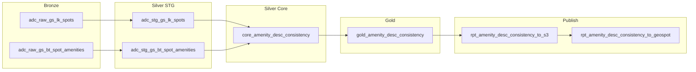

# Pipeline de Consistencia Amenidad-Descripcion

> **Version en ingles**: [README.md](README.md)

Este pipeline detecta **amenidades tagueadas que no se mencionan en la descripcion generada por IA de un spot**. Cada spot se clasifica segun su nivel de omision, produciendo una tabla de reporte (`rpt_amenity_description_consistency`) que permite la revision de calidad de las descripciones de spots.

El analisis se enfoca exclusivamente en **omisiones**: amenidades que estan asignadas a un spot pero nunca se referencian en su texto descriptivo. El caso inverso (amenidades mencionadas en la descripcion pero no tagueadas) esta fuera del alcance de este pipeline.

---

## Tabla de Contenidos

1. [Alcance](#alcance)
2. [Arquitectura del Pipeline](#arquitectura-del-pipeline)
3. [Trigger / Programacion](#trigger--programacion)
4. [Esquema de Salida](#esquema-de-salida)
5. [Clasificacion por Categoria](#clasificacion-por-categoria)
6. [Algoritmo de Matching](#algoritmo-de-matching)
7. [Referencia del Diccionario de Sinonimos](#referencia-del-diccionario-de-sinonimos)
8. [Logica de Checkers Personalizados](#logica-de-checkers-personalizados)
9. [Testing](#testing)
10. [Como Mejorar](#como-mejorar)

---

## Alcance

| Filtro | Condicion |
|---|---|
| Tipos de spot | Single (`spot_type_id = 1`) y Subspace (`spot_type_id = 3`). Los spots Complex estan excluidos. |
| Estados del spot | Solo estados publicos y desactivados: `spot_status_full_id IN (100, 305, 306, 309, 315, 308)`. Los spots eliminados estan excluidos. |
| Descripciones | Solo spots con descripcion no vacia (`spot_description IS NOT NULL AND LENGTH(TRIM(spot_description)) > 0`). |
| Direccion del analisis | Solo omisiones: amenidades tagueadas que **no** se mencionan en la descripcion. |

---

## Arquitectura del Pipeline

El pipeline sigue la **Arquitectura Medallon** (Bronze / Silver / Gold / Publish):



| Capa | Assets | Descripcion |
|---|---|---|
| **Bronze** | `adc_raw_gs_lk_spots`, `adc_raw_gs_bt_spot_amenities` | Extraccion cruda desde GeoSpot PostgreSQL. `lk_spots` se filtra por tipo, estado y descripcion no vacia. `bt_spot_amenities` extrae pares `spot_id` + `spa_amenity_name`. |
| **Silver STG** | `adc_stg_gs_lk_spots`, `adc_stg_gs_bt_spot_amenities` | Normalizacion de tipos (casting de columnas a `Int64` / `Utf8`). Sin joins ni logica de negocio. |
| **Silver Core** | `core_amenity_desc_consistency` | Logica central. Une spots con sus amenidades tagueadas, aplica matching por regex usando el diccionario de sinonimos y clasifica cada spot en una categoria. |
| **Gold** | `gold_amenity_desc_consistency` | Agrega campos de auditoria estandar (`aud_inserted_at`, `aud_inserted_date`, `aud_updated_at`, `aud_updated_date`, `aud_job`). |
| **Publish** | `rpt_amenity_desc_consistency_to_s3`, `rpt_amenity_desc_consistency_to_geospot` | Escribe la salida Gold como CSV en S3, luego dispara la API de GeoSpot para cargarla en PostgreSQL (tabla `rpt_amenity_description_consistency`, modo replace). |

---

## Trigger / Programacion

El pipeline se dispara mediante un **sensor** en lugar de un cron schedule:

| Propiedad | Valor |
|---|---|
| Nombre del sensor | `adc_after_spot_amenities_sensor` |
| Job upstream | `spot_amenities_job` |
| Delay | 600 segundos (10 minutos) despues de que el job upstream termine |
| Intervalo de verificacion | 300 segundos (5 minutos) |
| Ventana de revision | 24 horas |
| Estado por defecto | Running |

**Logica**: El sensor consulta la ultima ejecucion exitosa de `spot_amenities_job`. Cuando detecta una ejecucion nueva que tiene al menos 10 minutos de antigueedad (para permitir que la carga asincrona de GeoSpot termine), lanza `amenity_desc_consistency_job`. Un cursor rastrea la ultima ejecucion procesada para evitar lanzamientos duplicados.

---

## Esquema de Salida

**Tabla**: `rpt_amenity_description_consistency`
**Modo**: Replace (reemplazo completo de la tabla en cada ejecucion)

La tabla excluye intencionalmente los campos derivados de fuentes (`spot_type`, `spot_status_full`, `spot_description`) para mantener el esquema ligero. Estos pueden obtenerse mediante `JOIN lk_spots USING (spot_id)` cuando sea necesario. El asset Core los retiene internamente para el algoritmo de matching y las muestras de test.

### Identificador de spot

| Columna | Tipo | Descripcion |
|---|---|---|
| `spot_id` | `BIGINT NOT NULL` | Identificador del spot (JOIN con `lk_spots` para tipo, estado, descripcion) |

### Campos especificos del reporte (prefijo `adc_`)

| Columna | Tipo | Descripcion |
|---|---|---|
| `adc_tagged_amenities` | `TEXT` | Lista separada por comas de nombres de amenidades tagueadas al spot |
| `adc_mentioned_amenities` | `TEXT` | Lista separada por comas de amenidades tagueadas encontradas en la descripcion |
| `adc_omitted_amenities` | `TEXT` | Lista separada por comas de amenidades tagueadas NO encontradas en la descripcion |
| `adc_total_tagged` | `INTEGER` | Conteo de amenidades tagueadas |
| `adc_total_mentioned` | `INTEGER` | Conteo de amenidades mencionadas |
| `adc_total_omitted` | `INTEGER` | Conteo de amenidades omitidas |
| `adc_mention_rate` | `DOUBLE PRECISION` | Ratio: `mencionadas / tagueadas` (0.0 a 1.0) |
| `adc_category_id` | `INTEGER NOT NULL` | Categoria numerica (ver [Clasificacion por Categoria](#clasificacion-por-categoria)) |
| `adc_category` | `VARCHAR(50) NOT NULL` | Etiqueta en ingles de la categoria |

### Campos de auditoria

| Columna | Tipo | Descripcion |
|---|---|---|
| `aud_inserted_at` | `TIMESTAMP` | Timestamp de la primera insercion |
| `aud_inserted_date` | `DATE` | Fecha de la primera insercion |
| `aud_updated_at` | `TIMESTAMP` | Timestamp de la ultima actualizacion |
| `aud_updated_date` | `DATE` | Fecha de la ultima actualizacion |
| `aud_job` | `VARCHAR(200)` | Nombre del job de Dagster que produjo la fila |

### Indices

- `idx_rpt_adc_spot_id` en `spot_id`
- `idx_rpt_adc_category_id` en `adc_category_id`
- `idx_rpt_adc_mention_rate` en `adc_mention_rate`

---

## Clasificacion por Categoria

Cada spot recibe exactamente una categoria basada en cuantas de sus amenidades tagueadas se mencionan en la descripcion:

| `adc_category_id` | `adc_category` | Condicion |
|---|---|---|
| 1 | All mentioned | Todas las amenidades tagueadas fueron encontradas en la descripcion (`adc_total_omitted = 0`) |
| 2 | Partial omission | Algunas amenidades tagueadas fueron encontradas, otras no (`adc_total_mentioned > 0 AND adc_total_omitted > 0`) |
| 3 | Total omission | Ninguna amenidad tagueada fue encontrada en la descripcion (`adc_total_mentioned = 0`) |

La **tasa de mencion** se calcula como:

```
adc_mention_rate = adc_total_mentioned / adc_total_tagged
```

Una tasa de `1.0` significa que todas las amenidades estan mencionadas (categoria 1), mientras que `0.0` significa que ninguna se menciona (categoria 3).

---

## Algoritmo de Matching

El algoritmo de matching es deterministico y basado en regex. No utiliza machine learning ni LLMs; en su lugar, se apoya en diccionarios de sinonimos curados para cada amenidad.

### Proceso paso a paso

1. **Agregar amenidades tagueadas por spot**: Las filas de `bt_spot_amenities` se agrupan por `spot_id`, produciendo una lista de nombres de amenidades para cada spot.

2. **Join con descripciones de spots**: Un inner join entre la tabla de spots (con descripciones) y las amenidades agregadas produce el conjunto de trabajo: spots que tienen tanto una descripcion no vacia como al menos una amenidad tagueada.

3. **Normalizacion de texto**: La descripcion del spot se convierte a minusculas. Todos los patrones regex usan matching case-insensitive (`re.IGNORECASE`), por lo que las comparaciones son sensibles a acentos pero insensibles a mayusculas/minusculas.

4. **Matching por amenidad**: Para cada amenidad tagueada en un spot, el algoritmo busca la **funcion checker** correspondiente en el diccionario `AMENITY_CHECKERS`. Existen dos tipos de checkers:
   - **Checkers simples**: Creados con `_make_simple_checker(*patterns)`. Compilan multiples patrones regex en un unico patron OR y devuelven `True` si algun patron coincide en cualquier parte de la descripcion.
   - **Checkers personalizados**: Funciones escritas a mano (`_check_bodega`, `_check_luz`, `_check_cocina`) que implementan matching sensible al contexto con logica de exclusion.

5. **Fallback para amenidades desconocidas**: Si el nombre de una amenidad no tiene un checker correspondiente en el diccionario, se clasifica automaticamente como **omitida**. Esto asegura que el algoritmo es compatible con nuevas amenidades agregadas al catalogo.

6. **Clasificacion**: Despues de procesar todas las amenidades tagueadas para un spot, el algoritmo cuenta las mencionadas y omitidas y asigna una categoria.

### Orden de evaluacion

El diccionario `AMENITY_CHECKERS` es un `dict` de Python, que preserva el orden de insercion. El orden es importante para dos pares de amenidades:

- **`cocina equipada`** se evalua **antes** que `Cocina`: La funcion `_check_cocina` elimina "cocina equipada" y "cocina integral" del texto antes de buscar "cocina". Si ambas amenidades estan tagueadas, "cocina equipada" ya fue resuelta por su propio checker simple, y `Cocina` solo coincide con ocurrencias independientes.
- **`Planta de luz`** se evalua **antes** que `Luz`: La funcion `_check_luz` elimina "planta de luz" del texto antes de buscar "luz". Esto previene que "planta de luz" se cuente como ambas amenidades.

---

## Referencia del Diccionario de Sinonimos

A continuacion se presenta el diccionario completo de las 19 amenidades y sus patrones de sinonimos. Cada amenidad se lista con su nombre exacto tal como aparece en la tabla `bt_spot_amenities`.

### 1. Banos

| Propiedad | Valor |
|---|---|
| **Nombre de amenidad** | `Baños` |
| **Tipo de checker** | Simple |
| **Sinonimos** | `baño`, `baños`, `sanitarios`, `wc`, `medio baño`, `medios baños` |
| **Notas** | Coincide con formas singulares y plurales. Se aceptan variantes con y sin acento (`ñ` / `n`). |

### 2. Wifi

| Propiedad | Valor |
|---|---|
| **Nombre de amenidad** | `Wifi` |
| **Tipo de checker** | Simple |
| **Sinonimos** | `wifi`, `wi-fi`, `wi fi`, `internet` |
| **Notas** | Se aceptan formas con guion, con espacio y concatenadas. |

### 3. A/C

| Propiedad | Valor |
|---|---|
| **Nombre de amenidad** | `A/C` |
| **Tipo de checker** | Simple |
| **Sinonimos** | `a/c`, `aire acondicionado`, `climatizado`, `climatizada`, `climatización` |
| **Notas** | Coincide con ambas formas de genero de "climatizado/a" y el sustantivo "climatización". |

### 4. Estacionamiento

| Propiedad | Valor |
|---|---|
| **Nombre de amenidad** | `Estacionamiento` |
| **Tipo de checker** | Simple |
| **Sinonimos** | `estacionamiento`, `estacionamientos`, `cajón de estacionamiento`, `cajones de estacionamiento`, `parking`, `cochera`, `cocheras`, `garage` |
| **Notas** | Cubre los terminos mas comunes en espanol e ingles para estacionamiento. |

### 5. Bodega

| Propiedad | Valor |
|---|---|
| **Nombre de amenidad** | `Bodega` |
| **Tipo de checker** | **Personalizado** (`_check_bodega`) |
| **Sinonimos** | `bodega`, `bodegas`, `almacén`, `almacenes`, `almacenamiento` |
| **Exclusiones** | `bodega industrial`, `bodegas industriales`, `bodega comercial`, `bodegas comerciales` |
| **Notas** | La palabra "bodega" en las descripciones frecuentemente se refiere al tipo de spot (ej., "bodega industrial en renta") en lugar de a una amenidad de almacenamiento. El checker personalizado elimina estas frases contextuales primero; si "bodega" aun aparece en otra parte del texto, cuenta como coincidencia. Los sinonimos "almacén" y "almacenamiento" siempre se aceptan sin exclusiones. |

### 6. Accesibilidad

| Propiedad | Valor |
|---|---|
| **Nombre de amenidad** | `Accesibilidad` |
| **Tipo de checker** | Simple |
| **Sinonimos** | `accesibilidad`, `acceso para discapacitados`, `rampa de acceso` |
| **Notas** | Terminos genericos como "accesible" o "fácil acceso" fueron excluidos intencionalmente porque en las descripciones de spots casi siempre se refieren a accesibilidad de ubicacion en lugar de accesibilidad para personas con discapacidad. |

### 7. Luz

| Propiedad | Valor |
|---|---|
| **Nombre de amenidad** | `Luz` |
| **Tipo de checker** | **Personalizado** (`_check_luz`) |
| **Sinonimos** | `luz`, `suministro eléctrico`, `energía eléctrica`, `servicio de luz`, `luz natural`, `iluminación` |
| **Exclusiones** | `planta de luz`, `luz trifásica` |
| **Notas** | "Luz" como amenidad se refiere al servicio electrico. El checker personalizado primero prueba sinonimos inequivocos (`suministro eléctrico`, `energía eléctrica`, `servicio de luz`, `luz natural`, `iluminación`), que siempre devuelven coincidencia. Luego elimina `planta de luz` y `luz trifásica` del texto antes de buscar `luz` de forma independiente. "Luz natural" e "iluminación" se incluyen porque no existe una amenidad separada para luz natural o iluminacion en el catalogo de amenidades, y estos terminos en descripciones de spots tagueados con "Luz" se refieren consistentemente a esta amenidad. |

### 8. Sistema de seguridad

| Propiedad | Valor |
|---|---|
| **Nombre de amenidad** | `Sistema de seguridad` |
| **Tipo de checker** | Simple |
| **Sinonimos** | `sistema de seguridad`, `seguridad 24`, `vigilancia`, `cámaras de seguridad`, `circuito cerrado`, `cctv` |
| **Notas** | "Seguridad 24" coincide con frases como "seguridad 24 horas" o "seguridad 24/7". El matching insensible a acentos cubre `cámaras` / `camaras`. |

### 9. Montacargas

| Propiedad | Valor |
|---|---|
| **Nombre de amenidad** | `Montacargas` |
| **Tipo de checker** | Simple |
| **Sinonimos** | `montacargas` |
| **Notas** | La palabra es invariante en singular/plural en espanol. |

### 10. Pizarron

| Propiedad | Valor |
|---|---|
| **Nombre de amenidad** | `Pizarrón` |
| **Tipo de checker** | Simple |
| **Sinonimos** | `pizarrón`, `pizarron`, `pizarrones` |
| **Notas** | Coincide con formas acentuadas y no acentuadas, singular y plural. |

### 11. Elevador

| Propiedad | Valor |
|---|---|
| **Nombre de amenidad** | `Elevador` |
| **Tipo de checker** | Simple |
| **Sinonimos** | `elevador`, `elevadores`, `ascensor`, `ascensores` |
| **Notas** | Se cubren ambos terminos comunes en espanol para elevador. |

### 12. Terraza

| Propiedad | Valor |
|---|---|
| **Nombre de amenidad** | `Terraza` |
| **Tipo de checker** | Simple |
| **Sinonimos** | `terraza`, `terrazas`, `roof garden`, `rooftop` |
| **Notas** | Se incluyen terminos en ingles comunmente usados en listados inmobiliarios mexicanos. |

### 13. Zona de limpieza

| Propiedad | Valor |
|---|---|
| **Nombre de amenidad** | `Zona de limpieza` |
| **Tipo de checker** | Simple |
| **Sinonimos** | `zona de limpieza`, `área de limpieza`, `cuarto de limpieza` |
| **Notas** | El matching insensible a acentos cubre `área` / `area`. |

### 14. Posibilidad a dividirse

| Propiedad | Valor |
|---|---|
| **Nombre de amenidad** | `Posibilidad a dividirse` |
| **Tipo de checker** | Simple |
| **Sinonimos** | `dividirse`, `posibilidad a división`, `posibilidad de división`, `posibilidad a dividir`, `posibilidad de dividir`, `subdividir`, `seccionar`, `opción de unir` |
| **Notas** | El verbo "dividirse" solo es suficiente para coincidir, ya que implica fuertemente divisibilidad en un contexto inmobiliario. "Opción de unir" se incluye como el inverso conceptual (dos unidades que pueden fusionarse). |

### 15. Mezzanine

| Propiedad | Valor |
|---|---|
| **Nombre de amenidad** | `Mezzanine` |
| **Tipo de checker** | Simple |
| **Sinonimos** | `mezzanine`, `mezzanines`, `mezanine`, `mezanines`, `entrepiso`, `entrepisos` |
| **Notas** | Se cubren variaciones comunes de ortografia (z simple/doble) y el equivalente en espanol "entrepiso". |

### 16. cocina equipada

| Propiedad | Valor |
|---|---|
| **Nombre de amenidad** | `cocina equipada` |
| **Tipo de checker** | Simple |
| **Sinonimos** | `cocina equipada`, `cocinas equipadas`, `cocina integral`, `cocinas integrales` |
| **Notas** | Esta amenidad es distinta de "Cocina" (cocina basica). Nota: el nombre de la amenidad comienza con minuscula en los datos fuente. |

### 17. Planta de luz

| Propiedad | Valor |
|---|---|
| **Nombre de amenidad** | `Planta de luz` |
| **Tipo de checker** | Simple |
| **Sinonimos** | `planta de luz`, `plantas de luz`, `planta eléctrica`, `plantas eléctricas`, `generador eléctrico`, `generadores eléctricos`, `subestación eléctrica`, `subestaciones eléctricas` |
| **Notas** | Cubre equipos de generacion de energia de respaldo. El matching insensible a acentos maneja `eléctrica` / `electrica` y `subestación` / `subestacion`. |

### 18. Cocina

| Propiedad | Valor |
|---|---|
| **Nombre de amenidad** | `Cocina` |
| **Tipo de checker** | **Personalizado** (`_check_cocina`) |
| **Sinonimos** | `cocina`, `cocinas`, `cocineta`, `cocinetas`, `kitchenette`, `kitchenettes` |
| **Exclusiones** | `cocina equipada`, `cocinas equipadas`, `cocina integral`, `cocinas integrales` |
| **Notas** | El checker personalizado primero prueba `cocineta` o `kitchenette` (siempre aceptados). Luego elimina variantes de "cocina equipada" y "cocina integral" del texto antes de buscar "cocina" de forma independiente. Esto previene el doble conteo cuando un spot tiene tagueadas tanto "Cocina" como "cocina equipada". |

### 19. Tapanco

| Propiedad | Valor |
|---|---|
| **Nombre de amenidad** | `Tapanco` |
| **Tipo de checker** | Simple |
| **Sinonimos** | `tapanco`, `tapancos` |
| **Notas** | Termino regional mexicano para una plataforma de almacenamiento tipo loft/atico, usado principalmente en espacios industriales/bodegas. |

---

## Logica de Checkers Personalizados

Tres amenidades requieren matching sensible al contexto que no se puede lograr con un simple OR de patrones. Cada checker personalizado sigue la misma estrategia: **eliminar frases conocidas de falsos positivos, luego verificar el termino base**.

### `_check_bodega`

**Problema**: La palabra "bodega" aparece frecuentemente en las descripciones como calificador del tipo de spot (ej., "bodega industrial en renta de 500 m²") en lugar de como referencia a una amenidad.

**Algoritmo**:
1. Verificar sinonimos inequivocos: `almacén`, `almacenes`, `almacenamiento`. Si se encuentra, devolver `True` inmediatamente.
2. Verificar si el texto contiene "bodega(s) industrial(es)" o "bodega(s) comercial(es)".
3. Si esas frases existen, eliminarlas del texto.
4. Verificar si "bodega(s)" aun aparece en el texto limpio.
5. Si aparece, devolver `True` (la descripcion menciona bodega tanto como tipo de spot como amenidad).
6. Si no aparece, verificar los sinonimos inequivocos.
7. Si ninguno de los anteriores coincide, devolver `False`.

### `_check_luz`

**Problema**: "Luz" (servicio electrico) puede confundirse con "planta de luz" (generador de respaldo, una amenidad separada) y "luz trifásica" (corriente trifasica, una especificacion tecnica en lugar de una mencion de amenidad).

**Algoritmo**:
1. Verificar sinonimos inequivocos: `suministro eléctrico`, `energía eléctrica`, `servicio de luz`, `luz natural`, `iluminación`. Si alguno se encuentra, devolver `True` inmediatamente.
2. Eliminar "planta(s) de luz" del texto.
3. Eliminar "luz trifásica" del texto.
4. Verificar si "luz" aun aparece en el texto limpio.
5. Si aparece, devolver `True`. De lo contrario, devolver `False`.

**Nota sobre "luz natural" e "iluminación"**: Estos se incluyeron despues de que el analisis confirmo que el catalogo de amenidades no tiene una amenidad separada para luz natural o iluminacion. Cuando estos terminos aparecen en descripciones de spots tagueados con "Luz", se refieren a la amenidad de servicio electrico.

### `_check_cocina`

**Problema**: "Cocina" (cocina basica) debe distinguirse de "cocina equipada" (cocina equipada, una amenidad separada) y "cocina integral" (cocina integrada, tratada como equivalente a "cocina equipada").

**Algoritmo**:
1. Verificar `cocineta` o `kitchenette`. Si se encuentra, devolver `True` inmediatamente (estos siempre indican una cocina basica).
2. Eliminar "cocina(s) equipada(s)" del texto.
3. Eliminar "cocina(s) integral(es)" del texto.
4. Verificar si "cocina(s)" aun aparece en el texto limpio.
5. Si aparece, devolver `True`. De lo contrario, devolver `False`.

---

## Testing

Un script de test esta disponible en:

```
lakehouse-sdk/tests/amenity_description_consistency/test_amenity_desc_consistency.py
```

### Como ejecutar

```bash
cd dagster-pipeline
uv run python ../lakehouse-sdk/tests/amenity_description_consistency/test_amenity_desc_consistency.py
```

### Que hace

1. Materializa los assets Bronze, STG y Core localmente (sin Gold/Publish).
2. Imprime un **resumen por categoria** con conteos y porcentajes.
3. Imprime un **ranking de omision de amenidades** mostrando cuales amenidades se omiten con mas frecuencia.
4. Extrae **5 spots aleatorios por categoria** como muestras de control para validacion manual.
5. Guarda un reporte en markdown en `lakehouse-sdk/tests/amenity_description_consistency/reports/`.

El test esta disenado para **refinamiento iterativo de patrones**: ejecutarlo, inspeccionar las muestras, ajustar los patrones de sinonimos en el asset core, y re-ejecutar para verificar las mejoras.

---

## Como Mejorar

### Agregar un nuevo sinonimo

1. Abrir `silver/core/core_amenity_desc_consistency.py`.
2. Encontrar la amenidad en el diccionario `AMENITY_CHECKERS`.
3. Para checkers simples, agregar un nuevo patron regex string a la llamada `_make_simple_checker(...)`.
4. Para checkers personalizados, modificar la funcion correspondiente (`_check_bodega`, `_check_luz`, o `_check_cocina`).
5. Ejecutar el script de test para verificar que el cambio mejora los resultados sin introducir falsos positivos.
6. Actualizar este README-ES.md y README.md para reflejar el nuevo sinonimo.

### Agregar una nueva amenidad

1. Agregar una nueva entrada al diccionario `AMENITY_CHECKERS` con el nombre de la amenidad exactamente como aparece en `bt_spot_amenities`.
2. Definir su checker (simple o personalizado).
3. Ejecutar el script de test e inspeccionar las muestras.
4. Actualizar este README-ES.md y README.md.

### Convertir a matching basado en LLM

El enfoque deterministico actual tiene limitaciones con el lenguaje dependiente del contexto. Para mayor precision, el paso de matching podria reemplazarse con un enfoque basado en LLM que entienda el significado semantico. La arquitectura del pipeline (Bronze/Silver/Gold/Publish) y el trigger del sensor permanecerian sin cambios; solo el asset `core_amenity_desc_consistency` necesitaria modificacion.

Si las descripciones de amenidades se reestructuran siguiendo el formato AI-friendly propuesto mas abajo (ver [Hacer las descripciones de amenidades AI-friendly](#hacer-las-descripciones-de-amenidades-ai-friendly)), un refactor basado en LLM de este algoritmo se beneficiaria directamente: el modelo podria recibir la definicion, lista de sinonimos y nota de uso de cada amenidad como contexto, permitiendole detectar tanto omisiones como menciones falsas con mucha mayor precision que el regex solo — especialmente para terminos ambiguos como "bodega", "luz" o "cocina" donde el significado depende del contexto a nivel de oracion.

### Hacer las descripciones de amenidades AI-friendly

Una fuente significativa de omisiones es que el modelo de IA que genera las descripciones de spots no tiene una guia estructurada sobre que amenidades existen en el catalogo ni como deben ser referenciadas. Mejorar el campo `amenity_description` en la tabla `amenities` para incluir **listas de sinonimos legibles por maquina** permitiria que el prompt de generacion de descripciones nombre explicitamente cada amenidad tagueada.

La descripcion de cada amenidad podria seguir una estructura estandarizada con tres secciones:

1. **Definicion**: Una explicacion concisa y legible de que es la amenidad.
2. **Sinonimos**: Una lista separada por comas de todos los terminos aceptables que se refieren a esta amenidad (coincidiendo con el diccionario de sinonimos de este pipeline).
3. **Nota de uso**: Guia contextual para la IA sobre cuando y como mencionar la amenidad en la descripcion de un spot.

**Ejemplo** (para la amenidad `Bodega`, almacenado en `amenities.amenity_description`):

```
Definicion: Area de almacenamiento dentro de la propiedad, separada del espacio
principal utilizable, destinada a guardar insumos, inventario o equipos.

Sinonimos: bodega, almacen, almacenamiento, storage, warehouse area.

Nota de uso: Mencionar esta amenidad cuando el spot tiene un espacio de
almacenamiento dedicado como caracteristica (ej., "cuenta con bodega para
almacenamiento"). NO usar "bodega" cuando se refiera al tipo de spot en si
(ej., "bodega industrial en renta"). Si el tipo de spot ya es una bodega, usar
"almacen" o "area de almacenamiento" para diferenciar la amenidad del tipo de spot.
```

**Ejemplo** (para la amenidad `Luz`):

```
Definicion: Servicio electrico / suministro de energia disponible en la propiedad.

Sinonimos: luz, suministro electrico, energia electrica, servicio de luz,
iluminacion, luz natural.

Nota de uso: Mencionar cuando la propiedad tiene servicio electrico como
caracteristica. Usar "suministro electrico" o "energia electrica" para mayor
claridad. "Luz natural" e "iluminacion" son aceptables al describir condiciones
de iluminacion. Evitar confusion con "planta de luz" (generador de respaldo,
una amenidad separada) o "luz trifasica" (una especificacion tecnica).
```

**Ejemplo** (para la amenidad `Cocina`):

```
Definicion: Cocina basica o area de cocineta dentro de la propiedad.

Sinonimos: cocina, cocineta, kitchenette, kitchen area.

Nota de uso: Usar cuando el spot tiene una cocina basica o cocineta. NO usar
"cocina equipada" o "cocina integral" aqui — esas son una amenidad separada
("cocina equipada"). Si ambas amenidades estan tagueadas, mencionar cada una
de forma distinta (ej., "cuenta con cocineta y cocina equipada").
```

Este formato estructurado serviria un triple proposito:

1. **Ingenieria de prompts para generacion de descripciones**: El modelo de IA que genera las descripciones de spots podria recibir la lista de sinonimos y la nota de uso como parte de su prompt, reduciendo significativamente las omisiones desde el origen. El modelo sabria exactamente que terminos usar para cada amenidad tagueada, eliminando la ambiguedad.
2. **Deteccion de consistencia basada en LLM**: En un futuro refactor del algoritmo de matching de este pipeline (ver [Convertir a matching basado en LLM](#convertir-a-matching-basado-en-llm)), un LLM podria recibir la descripcion estructurada de la amenidad como contexto al evaluar si la descripcion de un spot menciona cada amenidad. Esto permitiria una deteccion mucho mas precisa que el regex, particularmente para terminos dependientes del contexto — el LLM entenderia, por ejemplo, que "bodega industrial en renta" se refiere al tipo de spot y no a la amenidad de almacenamiento, sin necesitar reglas de exclusion codificadas a mano.
3. **Sincronizacion automatizada del pipeline de validacion**: Las listas de sinonimos en las descripciones de amenidades podrian extraerse programaticamente y usarse para auto-generar el diccionario `AMENITY_CHECKERS`, manteniendo el pipeline de validacion deterministico sincronizado con la fuente de verdad mientras se desarrolla el enfoque basado en LLM.
