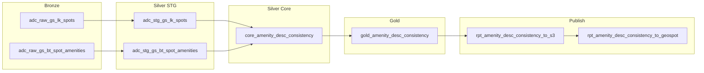

# Amenity-Description Consistency Pipeline

> **Spanish version**: [README-ES.md](README-ES.md)

This pipeline detects **tagged amenities that are not mentioned in a spot's AI-generated description**. Each spot is classified by its omission level, producing a report table (`rpt_amenity_description_consistency`) that enables quality review of spot descriptions.

The analysis focuses exclusively on **omissions**: amenities that are assigned to a spot but never referenced in its description text. The reverse case (amenities mentioned in the description but not tagged) is out of scope for this pipeline.

---

## Table of Contents

1. [Scope](#scope)
2. [Pipeline Architecture](#pipeline-architecture)
3. [Trigger / Scheduling](#trigger--scheduling)
4. [Output Schema](#output-schema)
5. [Category Classification](#category-classification)
6. [Matching Algorithm](#matching-algorithm)
7. [Synonym Dictionary Reference](#synonym-dictionary-reference)
8. [Custom Checker Logic](#custom-checker-logic)
9. [Testing](#testing)
10. [How to Improve](#how-to-improve)

---

## Scope

| Filter | Condition |
|---|---|
| Spot types | Single (`spot_type_id = 1`) and Subspace (`spot_type_id = 3`). Complex spots are excluded. |
| Spot statuses | Public and disabled statuses only: `spot_status_full_id IN (100, 305, 306, 309, 315, 308)`. Deleted spots are excluded. |
| Descriptions | Only spots with a non-empty description (`spot_description IS NOT NULL AND LENGTH(TRIM(spot_description)) > 0`). |
| Analysis direction | Omissions only: tagged amenities that are **not** mentioned in the description. |

---

## Pipeline Architecture

The pipeline follows the **Medallion Architecture** (Bronze / Silver / Gold / Publish):



| Layer | Assets | Description |
|---|---|---|
| **Bronze** | `adc_raw_gs_lk_spots`, `adc_raw_gs_bt_spot_amenities` | Raw extraction from GeoSpot PostgreSQL. `lk_spots` is filtered by type, status, and non-empty description. `bt_spot_amenities` extracts `spot_id` + `spa_amenity_name` pairs. |
| **Silver STG** | `adc_stg_gs_lk_spots`, `adc_stg_gs_bt_spot_amenities` | Type normalization (casting columns to `Int64` / `Utf8`). No joins or business logic. |
| **Silver Core** | `core_amenity_desc_consistency` | Central logic. Joins spots with their tagged amenities, applies regex matching using the synonym dictionary, and classifies each spot into a category. |
| **Gold** | `gold_amenity_desc_consistency` | Adds standard audit fields (`aud_inserted_at`, `aud_inserted_date`, `aud_updated_at`, `aud_updated_date`, `aud_job`). |
| **Publish** | `rpt_amenity_desc_consistency_to_s3`, `rpt_amenity_desc_consistency_to_geospot` | Writes the Gold output as CSV to S3, then triggers the GeoSpot API to load it into PostgreSQL (`rpt_amenity_description_consistency` table, replace mode). |

---

## Trigger / Scheduling

The pipeline is triggered by a **sensor** rather than a cron schedule:

| Property | Value |
|---|---|
| Sensor name | `adc_after_spot_amenities_sensor` |
| Upstream job | `spot_amenities_job` |
| Delay | 600 seconds (10 minutes) after upstream job completion |
| Check interval | 300 seconds (5 minutes) |
| Lookback window | 24 hours |
| Default status | Running |

**Logic**: The sensor polls for the latest successful run of `spot_amenities_job`. When it detects a new completion that is at least 10 minutes old (to allow the GeoSpot async load to finish), it launches `amenity_desc_consistency_job`. A cursor tracks the last processed run to avoid duplicate launches.

---

## Output Schema

**Table**: `rpt_amenity_description_consistency`
**Mode**: Replace (full table replacement on each run)

The table intentionally excludes source-derived fields (`spot_type`, `spot_status_full`, `spot_description`) to keep the schema lean. These can be obtained via `JOIN lk_spots USING (spot_id)` when needed. The Core asset retains them internally for the matching algorithm and test samples.

### Spot identifier

| Column | Type | Description |
|---|---|---|
| `spot_id` | `BIGINT NOT NULL` | Spot identifier (JOIN with `lk_spots` for type, status, description) |

### Report-specific fields (prefixed with `adc_`)

| Column | Type | Description |
|---|---|---|
| `adc_tagged_amenities` | `TEXT` | Comma-separated list of amenity names tagged to the spot |
| `adc_mentioned_amenities` | `TEXT` | Comma-separated list of tagged amenities found in the description |
| `adc_omitted_amenities` | `TEXT` | Comma-separated list of tagged amenities NOT found in the description |
| `adc_total_tagged` | `INTEGER` | Count of tagged amenities |
| `adc_total_mentioned` | `INTEGER` | Count of mentioned amenities |
| `adc_total_omitted` | `INTEGER` | Count of omitted amenities |
| `adc_mention_rate` | `DOUBLE PRECISION` | Ratio: `mentioned / tagged` (0.0 to 1.0) |
| `adc_category_id` | `INTEGER NOT NULL` | Numeric category (see [Category Classification](#category-classification)) |
| `adc_category` | `VARCHAR(50) NOT NULL` | English label for the category |

### Audit fields

| Column | Type | Description |
|---|---|---|
| `aud_inserted_at` | `TIMESTAMP` | Timestamp of first insert |
| `aud_inserted_date` | `DATE` | Date of first insert |
| `aud_updated_at` | `TIMESTAMP` | Timestamp of last update |
| `aud_updated_date` | `DATE` | Date of last update |
| `aud_job` | `VARCHAR(200)` | Dagster job name that produced the row |

### Indexes

- `idx_rpt_adc_spot_id` on `spot_id`
- `idx_rpt_adc_category_id` on `adc_category_id`
- `idx_rpt_adc_mention_rate` on `adc_mention_rate`

---

## Category Classification

Each spot is assigned exactly one category based on how many of its tagged amenities are mentioned in the description:

| `adc_category_id` | `adc_category` | Condition |
|---|---|---|
| 1 | All mentioned | Every tagged amenity was found in the description (`adc_total_omitted = 0`) |
| 2 | Partial omission | Some tagged amenities were found, some were not (`adc_total_mentioned > 0 AND adc_total_omitted > 0`) |
| 3 | Total omission | No tagged amenity was found in the description (`adc_total_mentioned = 0`) |

The **mention rate** is calculated as:

```
adc_mention_rate = adc_total_mentioned / adc_total_tagged
```

A rate of `1.0` means all amenities are mentioned (category 1), while `0.0` means none are mentioned (category 3).

---

## Matching Algorithm

The matching algorithm is deterministic and regex-based. It does not use machine learning or LLMs; instead, it relies on curated synonym dictionaries for each amenity.

### Step-by-step process

1. **Aggregate tagged amenities per spot**: The `bt_spot_amenities` rows are grouped by `spot_id`, producing a list of amenity names for each spot.

2. **Join with spot descriptions**: An inner join between the spots table (with descriptions) and the aggregated amenities produces the working set: spots that have both a non-empty description and at least one tagged amenity.

3. **Text normalization**: The spot description is converted to lowercase. All regex patterns use case-insensitive matching (`re.IGNORECASE`), so comparisons are accent-aware but case-insensitive.

4. **Per-amenity matching**: For each tagged amenity in a spot, the algorithm looks up the corresponding **checker function** in the `AMENITY_CHECKERS` dictionary. There are two types of checkers:
   - **Simple checkers**: Created with `_make_simple_checker(*patterns)`. They compile multiple regex patterns into a single OR pattern and return `True` if any pattern matches anywhere in the description.
   - **Custom checkers**: Hand-written functions (`_check_bodega`, `_check_luz`, `_check_cocina`) that implement context-sensitive matching with exclusion logic.

5. **Fallback for unknown amenities**: If an amenity name does not have a corresponding checker in the dictionary, it is automatically classified as **omitted**. This ensures the algorithm is forward-compatible with new amenities added to the catalog.

6. **Classification**: After processing all tagged amenities for a spot, the algorithm counts mentioned and omitted amenities and assigns a category.

### Evaluation order

The `AMENITY_CHECKERS` dictionary is a Python `dict`, which preserves insertion order. The order is important for two amenity pairs:

- **`cocina equipada`** is checked **before** `Cocina`: The `_check_cocina` function strips "cocina equipada" and "cocina integral" from the text before checking for "cocina". If both amenities are tagged, "cocina equipada" is already resolved by its own simple checker, and `Cocina` only matches standalone occurrences.
- **`Planta de luz`** is checked **before** `Luz`: The `_check_luz` function strips "planta de luz" from the text before checking for "luz". This prevents "planta de luz" from being counted as both amenities.

---

## Synonym Dictionary Reference

Below is the complete dictionary of all 19 amenities and their synonym patterns. Each amenity is listed with its exact name as it appears in the `bt_spot_amenities` table.

### 1. Banos

| Property | Value |
|---|---|
| **Amenity name** | `Baños` |
| **Checker type** | Simple |
| **Synonyms** | `baño`, `baños`, `sanitarios`, `wc`, `medio baño`, `medios baños` |
| **Notes** | Matches singular and plural forms. Accented and unaccented variants (`ñ` / `n`) are both matched. |

### 2. Wifi

| Property | Value |
|---|---|
| **Amenity name** | `Wifi` |
| **Checker type** | Simple |
| **Synonyms** | `wifi`, `wi-fi`, `wi fi`, `internet` |
| **Notes** | Hyphenated, spaced, and concatenated forms are all matched. |

### 3. A/C

| Property | Value |
|---|---|
| **Amenity name** | `A/C` |
| **Checker type** | Simple |
| **Synonyms** | `a/c`, `aire acondicionado`, `climatizado`, `climatizada`, `climatización` |
| **Notes** | Matches both gendered forms of "climatizado/a" and the noun "climatización". |

### 4. Estacionamiento

| Property | Value |
|---|---|
| **Amenity name** | `Estacionamiento` |
| **Checker type** | Simple |
| **Synonyms** | `estacionamiento`, `estacionamientos`, `cajón de estacionamiento`, `cajones de estacionamiento`, `parking`, `cochera`, `cocheras`, `garage` |
| **Notes** | Covers the most common Spanish and English terms for parking. |

### 5. Bodega

| Property | Value |
|---|---|
| **Amenity name** | `Bodega` |
| **Checker type** | **Custom** (`_check_bodega`) |
| **Synonyms** | `bodega`, `bodegas`, `almacén`, `almacenes`, `almacenamiento` |
| **Exclusions** | `bodega industrial`, `bodegas industriales`, `bodega comercial`, `bodegas comerciales` |
| **Notes** | The word "bodega" in descriptions often refers to the spot type (e.g., "bodega industrial en renta") rather than a storage amenity. The custom checker strips these contextual phrases first; if "bodega" still appears elsewhere in the text, it counts as a match. The synonyms "almacén" and "almacenamiento" are always accepted without exclusions. |

### 6. Accesibilidad

| Property | Value |
|---|---|
| **Amenity name** | `Accesibilidad` |
| **Checker type** | Simple |
| **Synonyms** | `accesibilidad`, `acceso para discapacitados`, `rampa de acceso` |
| **Notes** | Generic terms like "accesible" or "fácil acceso" were intentionally excluded because in spot descriptions they almost always refer to location accessibility rather than physical disability accessibility. |

### 7. Luz

| Property | Value |
|---|---|
| **Amenity name** | `Luz` |
| **Checker type** | **Custom** (`_check_luz`) |
| **Synonyms** | `luz`, `suministro eléctrico`, `energía eléctrica`, `servicio de luz`, `luz natural`, `iluminación` |
| **Exclusions** | `planta de luz`, `luz trifásica` |
| **Notes** | "Luz" as an amenity refers to electrical service. The custom checker first tests for unambiguous synonyms (`suministro eléctrico`, `energía eléctrica`, `servicio de luz`, `luz natural`, `iluminación`), which always return a match. Then it strips `planta de luz` and `luz trifásica` from the text before checking for standalone `luz`. "Luz natural" and "iluminación" are included because there is no separate amenity for natural light or lighting in the amenity catalog, and these terms in descriptions of spots tagged with "Luz" consistently refer to this amenity. |

### 8. Sistema de seguridad

| Property | Value |
|---|---|
| **Amenity name** | `Sistema de seguridad` |
| **Checker type** | Simple |
| **Synonyms** | `sistema de seguridad`, `seguridad 24`, `vigilancia`, `cámaras de seguridad`, `circuito cerrado`, `cctv` |
| **Notes** | "Seguridad 24" matches phrases like "seguridad 24 horas" or "seguridad 24/7". Accent-insensitive matching covers `cámaras` / `camaras`. |

### 9. Montacargas

| Property | Value |
|---|---|
| **Amenity name** | `Montacargas` |
| **Checker type** | Simple |
| **Synonyms** | `montacargas` |
| **Notes** | The word is invariant in singular/plural in Spanish. |

### 10. Pizarron

| Property | Value |
|---|---|
| **Amenity name** | `Pizarrón` |
| **Checker type** | Simple |
| **Synonyms** | `pizarrón`, `pizarron`, `pizarrones` |
| **Notes** | Matches accented and unaccented forms, singular and plural. |

### 11. Elevador

| Property | Value |
|---|---|
| **Amenity name** | `Elevador` |
| **Checker type** | Simple |
| **Synonyms** | `elevador`, `elevadores`, `ascensor`, `ascensores` |
| **Notes** | Both common Spanish terms for elevator are covered. |

### 12. Terraza

| Property | Value |
|---|---|
| **Amenity name** | `Terraza` |
| **Checker type** | Simple |
| **Synonyms** | `terraza`, `terrazas`, `roof garden`, `rooftop` |
| **Notes** | English terms commonly used in Mexican real estate listings are included. |

### 13. Zona de limpieza

| Property | Value |
|---|---|
| **Amenity name** | `Zona de limpieza` |
| **Checker type** | Simple |
| **Synonyms** | `zona de limpieza`, `área de limpieza`, `cuarto de limpieza` |
| **Notes** | Accent-insensitive matching covers `área` / `area`. |

### 14. Posibilidad a dividirse

| Property | Value |
|---|---|
| **Amenity name** | `Posibilidad a dividirse` |
| **Checker type** | Simple |
| **Synonyms** | `dividirse`, `posibilidad a división`, `posibilidad de división`, `posibilidad a dividir`, `posibilidad de dividir`, `subdividir`, `seccionar`, `opción de unir` |
| **Notes** | The verb "dividirse" alone is enough to match, as it strongly implies divisibility in a real estate context. "Opción de unir" is included as the conceptual inverse (two units that can be merged). |

### 15. Mezzanine

| Property | Value |
|---|---|
| **Amenity name** | `Mezzanine` |
| **Checker type** | Simple |
| **Synonyms** | `mezzanine`, `mezzanines`, `mezanine`, `mezanines`, `entrepiso`, `entrepisos` |
| **Notes** | Common spelling variations (single/double z) and the Spanish equivalent "entrepiso" are all matched. |

### 16. cocina equipada

| Property | Value |
|---|---|
| **Amenity name** | `cocina equipada` |
| **Checker type** | Simple |
| **Synonyms** | `cocina equipada`, `cocinas equipadas`, `cocina integral`, `cocinas integrales` |
| **Notes** | This amenity is distinct from "Cocina" (basic kitchen). Note that the amenity name starts with a lowercase letter in the source data. |

### 17. Planta de luz

| Property | Value |
|---|---|
| **Amenity name** | `Planta de luz` |
| **Checker type** | Simple |
| **Synonyms** | `planta de luz`, `plantas de luz`, `planta eléctrica`, `plantas eléctricas`, `generador eléctrico`, `generadores eléctricos`, `subestación eléctrica`, `subestaciones eléctricas` |
| **Notes** | Covers backup power generation equipment. Accent-insensitive matching handles `eléctrica` / `electrica` and `subestación` / `subestacion`. |

### 18. Cocina

| Property | Value |
|---|---|
| **Amenity name** | `Cocina` |
| **Checker type** | **Custom** (`_check_cocina`) |
| **Synonyms** | `cocina`, `cocinas`, `cocineta`, `cocinetas`, `kitchenette`, `kitchenettes` |
| **Exclusions** | `cocina equipada`, `cocinas equipadas`, `cocina integral`, `cocinas integrales` |
| **Notes** | The custom checker first tests for `cocineta` / `kitchenette` (always accepted). Then it strips "cocina equipada" and "cocina integral" variants from the text before checking for standalone "cocina". This prevents double-counting when a spot has both "Cocina" and "cocina equipada" tagged. |

### 19. Tapanco

| Property | Value |
|---|---|
| **Amenity name** | `Tapanco` |
| **Checker type** | Simple |
| **Synonyms** | `tapanco`, `tapancos` |
| **Notes** | Regional Mexican term for a loft/attic storage platform, primarily used in industrial/warehouse spaces. |

---

## Custom Checker Logic

Three amenities require context-sensitive matching that cannot be achieved with a simple OR of patterns. Each custom checker follows the same strategy: **strip known false-positive phrases, then check for the base term**.

### `_check_bodega`

**Problem**: The word "bodega" frequently appears in descriptions as a spot type qualifier (e.g., "bodega industrial en renta de 500 m²") rather than as an amenity reference.

**Algorithm**:
1. Check for unambiguous synonyms: `almacén`, `almacenes`, `almacenamiento`. If found, return `True` immediately.
2. Check if the text contains "bodega(s) industrial(es)" or "bodega(s) comercial(es)".
3. If those phrases exist, strip them from the text.
4. Check if "bodega(s)" still appears in the cleaned text.
5. If it does, return `True` (the description mentions bodega as both a spot type and an amenity).
6. If it does not, fall back to checking the unambiguous synonyms.
7. If none of the above match, return `False`.

### `_check_luz`

**Problem**: "Luz" (electrical service) can be confused with "planta de luz" (backup generator, a separate amenity) and "luz trifásica" (three-phase power, a technical specification rather than an amenity mention).

**Algorithm**:
1. Check for unambiguous synonyms: `suministro eléctrico`, `energía eléctrica`, `servicio de luz`, `luz natural`, `iluminación`. If any is found, return `True` immediately.
2. Strip "planta(s) de luz" from the text.
3. Strip "luz trifásica" from the text.
4. Check if "luz" still appears in the cleaned text.
5. If it does, return `True`. Otherwise, return `False`.

**Note on "luz natural" and "iluminación"**: These were included after analysis confirmed that the amenity catalog has no separate amenity for natural light or lighting. When these terms appear in descriptions of spots tagged with "Luz", they refer to the electrical service amenity.

### `_check_cocina`

**Problem**: "Cocina" (basic kitchen) must be distinguished from "cocina equipada" (equipped kitchen, a separate amenity) and "cocina integral" (built-in kitchen, treated as equivalent to "cocina equipada").

**Algorithm**:
1. Check for `cocineta` or `kitchenette`. If found, return `True` immediately (these always indicate a basic kitchen).
2. Strip "cocina(s) equipada(s)" from the text.
3. Strip "cocina(s) integral(es)" from the text.
4. Check if "cocina(s)" still appears in the cleaned text.
5. If it does, return `True`. Otherwise, return `False`.

---

## Testing

A test script is available at:

```
lakehouse-sdk/tests/amenity_description_consistency/test_amenity_desc_consistency.py
```

### How to run

```bash
cd dagster-pipeline
uv run python ../lakehouse-sdk/tests/amenity_description_consistency/test_amenity_desc_consistency.py
```

### What it does

1. Materializes the Bronze, STG, and Core assets locally (no Gold/Publish).
2. Prints a **summary by category** with counts and percentages.
3. Prints an **amenity omission ranking** showing which amenities are most frequently omitted.
4. Extracts **5 random spots per category** as control samples for manual validation.
5. Saves a markdown report to `lakehouse-sdk/tests/amenity_description_consistency/reports/`.

The test is designed for **iterative pattern refinement**: run it, inspect the samples, adjust synonym patterns in the core asset, and re-run to verify improvements.

---

## How to Improve

### Adding a new synonym

1. Open `silver/core/core_amenity_desc_consistency.py`.
2. Find the amenity in the `AMENITY_CHECKERS` dictionary.
3. For simple checkers, add a new regex pattern string to the `_make_simple_checker(...)` call.
4. For custom checkers, modify the corresponding function (`_check_bodega`, `_check_luz`, or `_check_cocina`).
5. Run the test script to verify the change improves results without introducing false positives.
6. Update this README and README-ES.md to reflect the new synonym.

### Adding a new amenity

1. Add a new entry to the `AMENITY_CHECKERS` dictionary with the amenity name exactly as it appears in `bt_spot_amenities`.
2. Define its checker (simple or custom).
3. Run the test script and inspect samples.
4. Update this README and README-ES.md.

### Converting to LLM-based matching

The current deterministic approach has limitations with context-dependent language. For higher accuracy, the matching step could be replaced with an LLM-based approach that understands semantic meaning. The pipeline architecture (Bronze/Silver/Gold/Publish) and the sensor trigger would remain unchanged; only the `core_amenity_desc_consistency` asset would need modification.

If the amenity descriptions are restructured following the AI-friendly format proposed below (see [Making amenity descriptions AI-friendly](#making-amenity-descriptions-ai-friendly)), an LLM-based refactor of this algorithm would benefit directly: the model could receive each amenity's definition, synonym list, and usage note as context, enabling it to detect both omissions and false mentions with much higher accuracy than regex alone — especially for ambiguous terms like "bodega", "luz", or "cocina" where the meaning depends on sentence-level context.

### Making amenity descriptions AI-friendly

A significant source of omissions is that the AI model generating spot descriptions does not have structured guidance about which amenities exist in the catalog or how they should be referenced. Improving the `amenity_description` field in the `amenities` table to include **machine-readable synonym lists** would allow the description-generation prompt to explicitly name each tagged amenity.

Each amenity's description could follow a standardized structure with three sections:

1. **Definition**: A concise, human-readable explanation of what the amenity is.
2. **Synonyms**: A comma-separated list of all acceptable terms that refer to this amenity (matching the synonym dictionary in this pipeline).
3. **Usage note**: Contextual guidance for the AI on when and how to mention the amenity in a spot description.

**Example** (for the `Bodega` amenity, stored in `amenities.amenity_description`):

```
Definition: Storage area within the property, separate from the main usable space,
intended for keeping supplies, inventory, or equipment.

Synonyms: bodega, almacén, almacenamiento, storage, warehouse area.

Usage note: Mention this amenity when the spot has a dedicated storage space as a
feature (e.g., "cuenta con bodega para almacenamiento"). Do NOT use "bodega" when
referring to the spot type itself (e.g., "bodega industrial en renta"). If the spot
type is already a warehouse, use "almacén" or "área de almacenamiento" to
differentiate the amenity from the spot type.
```

**Example** (for the `Luz` amenity):

```
Definition: Electrical service / power supply available in the property.

Synonyms: luz, suministro eléctrico, energía eléctrica, servicio de luz,
iluminación, luz natural.

Usage note: Mention when the property has electrical service as a feature. Use
"suministro eléctrico" or "energía eléctrica" for clarity. "Luz natural" and
"iluminación" are acceptable when describing lighting conditions. Avoid confusion
with "planta de luz" (backup generator, a separate amenity) or "luz trifásica"
(a technical specification).
```

**Example** (for the `Cocina` amenity):

```
Definition: Basic kitchen or kitchenette area within the property.

Synonyms: cocina, cocineta, kitchenette, kitchen area.

Usage note: Use when the spot has a basic kitchen or kitchenette. Do NOT use
"cocina equipada" or "cocina integral" here — those are a separate amenity
("cocina equipada"). If both amenities are tagged, mention each distinctly
(e.g., "cuenta con cocineta y cocina equipada").
```

This structured format would serve a triple purpose:

1. **Prompt engineering for description generation**: The AI model that generates spot descriptions could receive the synonym list and usage note as part of its prompt, significantly reducing omissions at the source. The model would know exactly which terms to use for each tagged amenity, eliminating ambiguity.
2. **LLM-based consistency detection**: In a future refactor of this pipeline's matching algorithm (see [Converting to LLM-based matching](#converting-to-llm-based-matching)), an LLM could receive the structured amenity description as context when evaluating whether a spot description mentions each amenity. This would enable far more accurate detection than regex, particularly for context-dependent terms — the LLM would understand, for example, that "bodega industrial en renta" refers to the spot type and not the storage amenity, without needing hand-coded exclusion rules.
3. **Automated validation pipeline sync**: The synonym lists in the amenity descriptions could be programmatically extracted and used to auto-generate the `AMENITY_CHECKERS` dictionary, keeping the deterministic validation pipeline in sync with the source of truth while the LLM-based approach is developed.
