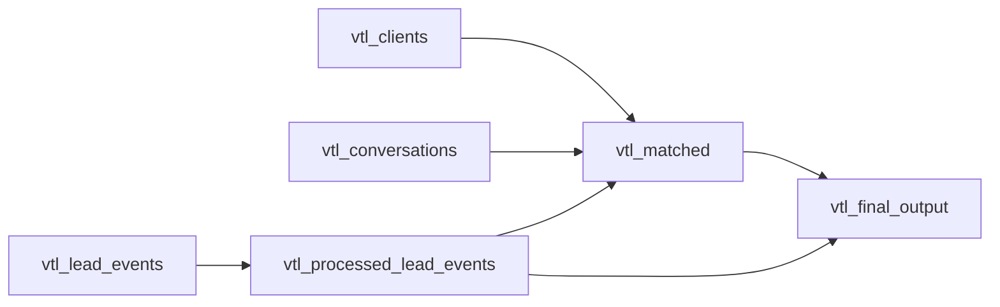

# Visitors to Leads (VTL) Pipeline — Context

This document provides context for AI assistants and developers working on the VTL pipeline. It explains the pipeline purpose, configuration options, key definitions, and important implementation details.

---

## Overview

The **Visitors to Leads** pipeline matches anonymous website visitors (`user_pseudo_id` from Google Analytics 4) to known clients (`client_id` from HubSpot) and WhatsApp conversations. It produces a unified table (`temp_matches_users_to_leads`) where each row represents a visitor and their match status (or lack thereof).

**Data sources:**
- **BigQuery** (`lead_events.sql`): GA4 events (clientRequestedWhatsappForm, clientSubmitFormBlog*, etc.) with `user_pseudo_id`, timestamps, email, phone, UTM.
- **MySQL (prod)** (`clients.sql`): HubSpot clients with `client_id`, phone, email, lead_min_at, lead_min_type.
- **Chatbot DB**: WhatsApp conversations with `phone_clean`, `conversation_start`, messages.

**Main output:** A CSV (or Parquet) with one row per distinct first event per user, enriched with `match_source`, `client_id`, `lead_date`, UTM, and related metadata.

---

## Pipeline Flow (Dagster Assets)



1. **vtl_clients**: Fetches clients from MySQL, normalizes `phone_clean`.
2. **vtl_lead_events**: Fetches GA4 events from BigQuery.
3. **vtl_conversations**: Fetches and groups WhatsApp chats by phone, gap_hours=24.
4. **vtl_processed_lead_events**: Filters Spot2 emails (optional), adds `phone_clean`, extracts first event per user (`df_first`), aggregated metrics.
5. **vtl_matched**: Runs the full matching logic (see Matching section below).
6. **vtl_final_output**: Builds `create_final_matches_all` → `create_final_matches_all_complete`, adds `with_match`, `year_month_first`, saves locally and/or uploads to S3.

---

## Configuration (VTLConfig)

| Option | Type | Default | Description |
|--------|------|---------|-------------|
| `start_date` | str | "2025-01-01" | Start of date range (YYYY-MM-DD). |
| `end_date` | str | today | End of date range (YYYY-MM-DD). |
| `time_buffer_seconds` | int | 60 | Time window (seconds) for spot-based matching: event must be within ±N seconds of first user message. |
| `try_subsequent_events` | bool | True | If True, try to match unmatched chats using subsequent events (not just first event) within `max_time_diff_minutes`. |
| `max_time_diff_minutes` | int | 1440 | Max minutes for subsequent-event matching (default 24h). |
| `deduplicate_matches` | bool | True | When one chat (phone) has multiple `user_pseudo_id`, keep only the closest to `conversation_start`. Disabled = keep all. |
| `keep_all_client_matches` | bool | False | When False: one row per `user_pseudo_id` (highest priority match only). When True: one row per `(user_pseudo_id, client_id)` so clients that would be dropped due to priority still get a row. |
| `include_spot2_emails` | bool | True | If True, include users with @spot2 email. If False, exclude them. |
| `upload_to_s3` | bool | False | Upload result to S3 and trigger table replacement. |
| `save_local` | bool | True | Save result to local file (output dir). |
| `output_format` | str | "csv" | "csv" or "parquet". |
| `output_dir` | str | "output" | Directory for local output files. |

---

## Matching Logic

The matching happens in `match_chats_to_lead_events` (utils/match_chats_to_leads.py), in this order:

1. **direct_client_match** (highest priority): User (from lead_events) has email/phone → matches client → client has chat. `direct_client_match_email`, `direct_client_match_phone`.
2. **via_client**: Chat matches client (by phone) → client has email/phone → find user in lead_events. `via_client_email`, `via_client_phone`, `via_client_both`.
3. **first_event**: Chat matched by spot_id and first event timestamp (within `time_buffer_seconds`).
4. **direct_phone_match**: Chat (phone_clean) matches lead_events (phone_clean) when user has no email match; used to recover leads with only phone.
5. **subsequent_event** (if `try_subsequent_events=True`): Same as first_event but using subsequent events within `max_time_diff_minutes`.

After matching, `deduplicate_multi_user_matches` (when `deduplicate_matches=True`) resolves cases where **one chat** has **multiple users** by keeping the user closest to `conversation_start`.

---

## create_final_matches_all — Final Deduplication

`create_final_matches_all` in `main.py` combines:

- **eventos_l1**: Blog submits (`clientsubmitformblog*`) with `match_source = l1_no_required_match`.
- **matches_chat** / **matches_sin_chat**: Matched rows from the matching pipeline.
- **wpp_desktop_no_match**: Users with `clientRequestedWhatsappForm` on desktop that were not matched (get `match_source = wpp_desktop_without_match`).

Then it applies **priority deduplication**:

- **match_source_priority** (highest first): `first_event`, `subsequent_event`, `via_client_both`, `via_client_email`, `via_client_phone`, `direct_client_match_email`, `direct_client_match_phone`.
- If `keep_all_client_matches=False`: `drop_duplicates(subset=["user_pseudo_id"], keep="first")` → one row per user; clients with lower-priority matches are dropped.
- If `keep_all_client_matches=True`: `drop_duplicates(subset=["user_pseudo_id", "client_id"], keep="first")` → one row per (user, client) pair; multiple clients per user are kept.

Conflict resolution: If a user has both `l1_no_required_match` and another match source, `l1_no_required_match` is discarded.

---

## Key Definitions

- **user_pseudo_id**: GA4 anonymous user ID (string, e.g. `"989107397.1771268336"`). Must be treated as **string** to avoid float precision loss.
- **client_id**: Client that is a lead. (integer).
- **phone_clean**: Normalized phone (E.164 or national MX format via `normalize_phone`). Never re-normalize an already-normalized value.
- **lead_date**: Date when the user became a lead; from `lead_min_at` if available, else `event_datetime`.
- **match_source**: How the user was matched (or `no_match` / `wpp_desktop_without_match`).
- **with_match**: `"with_match"` if `match_source` is not `no_match`, else `"without_match"`.

---

## Important Implementation Notes

### user_pseudo_id Precision
- BigQuery returns `user_pseudo_id` correctly. Precision is lost when reading CSVs with `pd.read_csv()` without `dtype`.
- Use `CSV_DTYPES_USER_PSEUDO_ID = {"user_pseudo_id": "string"}` and `read_temp_matches_csv()` when reading CSVs.
- `save_to_local` and S3 upload explicitly cast `user_pseudo_id` to `astype("string")`.

### Phone Normalization

**Rule:** When `phone_clean` already exists (from assets, get_conversations, or upstream), use it directly—do **not** call `normalize_phone()` again. Re-normalizing causes phonenumbers to misinterpret 10-digit national numbers as international (+55, etc.) and truncate.

**Float from DB:** When clients are read from MySQL, `phone_number` can be float (e.g. `5585647482.0`) if the column has NULLs. `normalize_phone` converts float-to-int when `num == int(num)` to avoid extra digits.

**Por qué no re-normalizar:** `normalize_phone` devuelve números MX en formato nacional (10 dígitos, ej. `"5585647482"`). Si se pasa de nuevo a `normalize_phone`, la lib `phonenumbers` puede interpretarlos como internacionales (ej. +55 Brasil) y truncar mal.

**Resumen detallado — Origen y uso de `phone_clean`:**

| Archivo | Líneas | Entidad | ¿Se normaliza aquí? | Origen del dato | Acción correcta |
|---------|--------|---------|---------------------|-----------------|------------------|
| **Creación inicial (normalize_phone)** | | | | | |
| assets.py | 29-31 | clients | ✅ Sí (1ª vez) | phone_number (MySQL) | `phone_clean = normalize_phone(phone_number)` |
| assets.py | 67-70 | lead_events | ✅ Sí (1ª vez) | phone (BigQuery) | `phone_clean = normalize_phone(phone)` |
| main.py | 269-271 | clients | ✅ Sí (1ª vez) | phone_number | Igual que assets (run_pipeline) |
| get_conversations.py | 62 | chats (fetch) | ✅ Sí (1ª vez) | phone_number (Chatbot) | `phone_clean = normalize_phone(phone_number)` |
| get_conversations.py | 80, 92 | chats (group) | ✅ Sí (1ª vez) | phone (del groupby) | `phone_clean = normalize_phone(phone)` |
| **Uso en matching (NO re-normalizar si phone_clean existe)** | | | | | |
| match_chats_to_leads.py | 114-118 | enrich_with_client_id | ⛔ No | matched rows (heredan phone_clean del chat) | Usar `phone_clean` directo; solo si falta → `normalize_phone(phone_number)` |
| match_chats_to_leads.py | 172-175 | match_chats_to_clients | ⛔ No | chats (de get_conversations) | Usar `phone_clean` directo; fallback `normalize_phone(phone_number)` |
| match_chats_to_leads.py | 223-231 | find_user_pseudo_ids_from_client | ⛔ No | lead_events_all | Si `phone_clean` existe → usar; else `normalize_phone(phone)` |
| match_chats_to_leads.py | 276-288 | match_users_to_clients_direct | ⛔ No | lead_events, chats | Ambos: usar `phone_clean` si existe; else normalizar |
| match_chats_to_leads.py | 506-511 | match_leads_to_chats_by_phone | ⛔ No (leads) | lead_events | Si `phone_clean` existe → filtrar y usar; else `normalize_phone(phone)` |
| match_chats_to_leads.py | 517-522 | match_leads_to_chats_by_phone | Parcial (chats) | chats | Si existe: solo rellenar NA con `normalize_phone(phone_number)`; si no existe: crear con normalize |
| **Clientes (siempre normalizar en merge)** | | | | | |
| phone_utils.py | 118-121 | compute_client_phone_clean | ✅ Sí | phone_number (raw del cliente) | Siempre `normalize_phone` — clients nunca llegan con phone_clean al merge |

**Nota:** En `main.run_pipeline()` (líneas 267-284) los `lead_events` no reciben `phone_clean` (a diferencia de assets). En ese flujo, `match_users_to_clients_direct` y `match_leads_to_chats_by_phone` usan el fallback `normalize_phone(phone)`, que es correcto.

### Output Columns
The final output includes: `user_pseudo_id`, `event_datetime_first`, `event_name_first`, `channel_first`, `match_source`, `client_id`, `conversation_start`, `event_datetime`, `event_name`, `channel`, `source`, `medium`, `campaign_name`, `phone_number`, `email_clients`, `lead_min_at`, `lead_min_type`, `lead_type`, `lead_date`, `with_match`, `year_month_first`, `page_location`.

---

## File Structure

```
visitors_to_leads/
├── config.py          # VTLConfig
├── main.py            # create_final_matches_all, create_final_matches_all_complete, run_pipeline, get_data
├── assets.py          # Dagster assets (vtl_clients, vtl_lead_events, vtl_conversations, vtl_processed_lead_events, vtl_matched, vtl_final_output)
├── queries/
│   ├── clients.sql    # MySQL: clients with lead_min_at, lead_min_type, lead_type
│   └── lead_events.sql# BigQuery: GA4 events with user_pseudo_id, email, phone, UTM
├── utils/
│   ├── database.py
│   ├── get_conversations.py
│   ├── lead_events_processing.py
│   ├── match_chats_to_leads.py   # Main matching pipeline
│   ├── phone_utils.py            # normalize_phone, compute_client_phone_clean
│   ├── s3_upload.py              # save_to_local, upload_dataframe_to_s3, trigger_table_replacement
│   └── ...
└── CONTEXT.md         # This file
```

---

## Downstream Impact

- **temp_matches_users_to_leads** table: Used by Geospot/data-lake-house. When `keep_all_client_matches=True`, the table will have duplicate `user_pseudo_id` with different `client_id`; downstream consumers must support this schema.
- **wpp_desktop_no_match**: Uses `pre_matches_user_ids` to exclude already-matched users; logic is unchanged by `keep_all_client_matches`.
