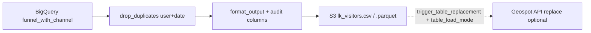

# LK Visitors pipeline

Pipeline que construye la tabla **lk_visitors**: funnel de visitantes desde GA4 (BigQuery), deduplicación por `(user_pseudo_id, vis_create_date)` y salida a S3 (CSV o Parquet) para consumo en el lakehouse.

## Flujo de datos

- **Origen:** BigQuery (`spot2-mx-ga4-bq.analitics_spot2.funnel_with_channel`).
- **Destino:** `s3://dagster-assets-production/lk_visitors/lk_visitors.csv` o `.parquet`. Opcional: reemplazo de tabla vía API Geospot (config).

## Archivos clave

| Archivo | Rol |
|---------|-----|
| `main.py` | `get_data`, `prepare_funnel_for_output`, `format_output` (incl. columnas de auditoría y PK). |
| `assets.py` | Assets Dagster: `lk_funnel_with_channel`, `lk_output`. |
| `queries/` | `funnel_with_channel.sql`. |
| `utils/s3_upload.py` | Subida S3, `trigger_table_replacement` (replace/upsert con conflict_columns, update_columns). |
| `utils/database.py` | BigQuery; credenciales vía SSM. |

## Definiciones

- **vis_id:** clave primaria = `user_pseudo_id` + `vis_create_date` (formato `{user}_{YYYYMMDD}`).
- **Columnas de auditoría:** `aud_inserted_date`, `aud_inserted_at`, `aud_updated_date`, `aud_updated_at`, `aud_job`. En este pipeline se rellenan todas en cada ejecución (snapshot completo).
- **Config** (`config.py`): `local_output`, `upload_to_s3`, `trigger_table_replacement`, `table_load_mode`, `output_format` (csv/parquet), `output_dir`. API key y DB vía SSM.

### Modo de carga (`table_load_mode`)

- **`replace`**: reemplazo completo (truncar + insertar).
- **`upsert`**: insertar filas nuevas y actualizar existentes según `vis_id` (conflict_columns).
