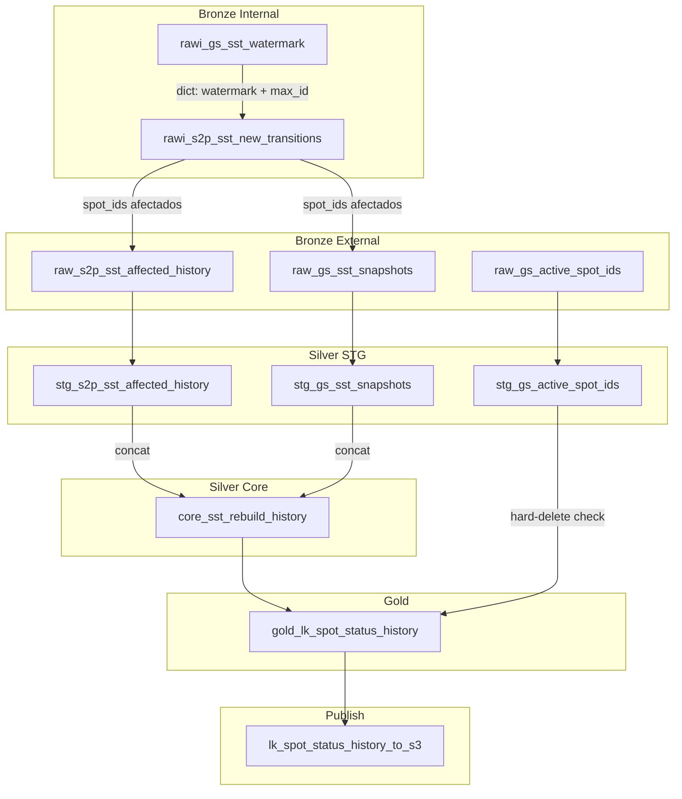

# Spot State Transitions (SST) Pipeline — Documentación para agentes

Este README describe el pipeline **spot_state_transitions** con el detalle necesario para que un agente (o un desarrollador) pueda extenderlo, modificar lógica o replicar patrones en otro pipeline.

---

## 1. Propósito del pipeline

- **Origen**: transiciones de estado de spots desde MySQL S2P (`spot_state_transitions`) y snapshots históricos desde GeoSpot PostgreSQL (`lk_spot_status_history`).
- **Salida**: tabla `lk_spot_status_history` como CSV en S3 (`spot_state_transitions/gold/lk_spot_status_history/data.csv`). El asset `_to_geospot` aún no existe (pendiente endpoint de upsert).
- **Flujo**: extracción incremental (watermark dual) → reconstrucción del historial de spots afectados → dedup → enriquecimiento (prev/next, IDs compuestos) → flag hard-delete → CSV a S3.
- **Schedule**: diario a las 9:00 AM `America/Mexico_City`.

---

## 2. Estructura de carpetas

```
defs/spot_state_transitions/
├── __init__.py          # Exporta todos los assets, job y schedule
├── shared.py            # Re-exporta helpers de data_lakehouse.shared
├── processing.py        # Data contracts + funciones puras de transformación (Polars)
├── jobs.py              # Job, schedule y asset selection
│
├── bronze/
│   ├── rawi_gs_sst_watermark.py          # Watermark dual desde GeoSpot
│   ├── rawi_s2p_sst_new_transitions.py   # Nuevas transiciones desde MySQL
│   ├── raw_s2p_sst_affected_history.py   # Historial completo MySQL (spots afectados)
│   ├── raw_gs_sst_snapshots.py           # Snapshots GeoSpot (source_id != 2)
│   └── raw_gs_active_spot_ids.py         # IDs activos desde lk_spots
│
├── silver/
│   ├── stg/
│   │   ├── stg_s2p_sst_affected_history.py   # Cast a TRANSITIONS_SCHEMA
│   │   ├── stg_gs_sst_snapshots.py            # Cast a TRANSITIONS_SCHEMA
│   │   └── stg_gs_active_spot_ids.py          # Cast spot_id a Int64
│   └── core/
│       └── core_sst_rebuild_history.py        # Concat + dedup + prev/next + sstd IDs
│
├── gold/
│   └── gold_lk_spot_status_history.py    # Hard-delete flag + audit fields
│
└── publish/
    └── lk_spot_status_history.py         # CSV a S3
```

### Archivos clave

| Archivo | Contenido |
|---------|-----------|
| `shared.py` | Re-exporta `query_bronze_source`, `write_polars_to_s3`, `build_gold_s3_key` desde `data_lakehouse.shared` |
| `processing.py` | `TRANSITIONS_SCHEMA`, `FINAL_COLUMNS`, `FINAL_RENAME`, y 4 funciones puras: `dedup_consecutive_runs`, `add_prev_fields`, `add_next_fields`, `add_sstd_ids` |
| `jobs.py` | `spot_state_transitions_daily_job` (upstream de `lk_spot_status_history_to_s3` + `cleanup_storage`), schedule cron `0 9 * * *` |

---

## 3. Diagrama del DAG



---

## 4. Assets (orden y dependencias)

| # | Asset | Group | Tipo | Dependencias | Retorna | Descripción |
|---|-------|-------|------|--------------|---------|-------------|
| 1 | `rawi_gs_sst_watermark` | sst_bronze | rawi | — | `dict` | MAX(source_sst_updated_at) y MAX(source_sst_id) de GeoSpot donde source_id = 2. Falla si no hay datos. |
| 2 | `rawi_s2p_sst_new_transitions` | sst_bronze | rawi | #1 | `pl.DataFrame` | Transiciones MySQL con `updated_at >= watermark OR id > max_id`. |
| 3 | `raw_s2p_sst_affected_history` | sst_bronze | raw | #2 | `pl.DataFrame` | Historial completo MySQL de los spots afectados (CTE con cut_date + dedup en SQL). |
| 4 | `raw_gs_sst_snapshots` | sst_bronze | raw | #2 | `pl.DataFrame` | Snapshots GeoSpot (source_id != 2) de los spots afectados. |
| 5 | `raw_gs_active_spot_ids` | sst_bronze | raw | — | `pl.DataFrame` | Todos los spot_id de lk_spots (independiente). |
| 6 | `stg_s2p_sst_affected_history` | sst_silver | stg | #3 | `pl.DataFrame` | Cast a `TRANSITIONS_SCHEMA`. |
| 7 | `stg_gs_sst_snapshots` | sst_silver | stg | #4 | `pl.DataFrame` | Cast a `TRANSITIONS_SCHEMA`. |
| 8 | `stg_gs_active_spot_ids` | sst_silver | stg | #5 | `pl.DataFrame` | Cast `spot_id` a Int64. |
| 9 | `core_sst_rebuild_history` | sst_silver | core | #6, #7 | `pl.DataFrame` | Concat → dedup → prev/next → sstd IDs → select + rename. |
| 10 | `gold_lk_spot_status_history` | sst_gold | gold | #9, #8 | `pl.DataFrame` | Flag hard-delete + audit fields. |
| 11 | `lk_spot_status_history_to_s3` | sst_publish | publish | #10 | `str` (S3 key) | CSV a S3. |

---

## 5. Lógica crítica por componente

### 5.1 Watermark dual (timestamp + max_id)

El mecanismo incremental usa **dos criterios** simultáneos:

- `updated_at >= watermark`: captura registros **editados** después de la última corrida.
- `id > max_id`: captura registros **nuevos** que pudieron insertarse con un timestamp anterior al watermark (relojes desincronizados, backfills, etc.).

Ambos valores se leen de GeoSpot (`lk_spot_status_history WHERE source_id = 2`) en un solo query.

### 5.2 Cut date y CTE de historial MySQL

`raw_s2p_sst_affected_history` usa `MYSQL_CUT_DATE = "2025-09-12 13:28:00"` para evitar leer millones de registros históricos anteriores a esa fecha. La estrategia:

1. **`ids_last_before`**: ROW_NUMBER descendente por spot, toma solo el último registro antes del corte.
2. **`last_before_cut`**: JOIN para obtener las columnas completas de ese registro.
3. **`post_cut`**: todos los registros desde el corte.
4. **`combined`**: UNION ALL de ambos.
5. **`sequenced` + `dedup`**: LAG + filtro para deduplicar consecutivos ya en SQL (reduce volumen antes de transferir).

El SELECT final renombra columnas al esquema canónico (`id → source_sst_id`, `created_at → source_sst_created_at`, etc.) y agrega `source_id = 2`, `source = 'spot_state_transitions'`.

### 5.3 Concepto de snapshots (source_id != 2)

GeoSpot contiene registros de `lk_spot_status_history` con distintos orígenes (`source_id`). Los registros con `source_id = 2` provienen de `spot_state_transitions` (MySQL). Los demás (`source_id != 2`) son "snapshots" de otras fuentes que deben **combinarse** con el historial MySQL para reconstruir la secuencia completa de cada spot.

### 5.4 Dedup de runs consecutivos (`dedup_consecutive_runs`)

Elimina pares `(state, reason)` consecutivos repetidos por spot, conservando el **primer** registro de cada racha:

1. Ordena por `[spot_id, source_sst_created_at, _row_id]`.
2. Concatena `state|reason` como string (nulls → `"__NA__"`).
3. Shift(1) global del par y del spot_id.
4. Una fila es un "cambio" si: nuevo grupo de spot, O el par difiere del anterior.
5. Filtra solo las filas de cambio.

Usa **global shift** en vez de `over()` para garantizar orden determinístico.

### 5.5 Campos prev/next (fronteras de grupo)

`add_prev_fields` y `add_next_fields` usan la misma técnica:

1. Shift(1) / shift(-1) global sobre el DataFrame ordenado.
2. Detectan fronteras de grupo comparando spot_id con la fila adyacente.
3. Null-out en fronteras (el primer registro de un spot no tiene prev; el último no tiene next).
4. Calculan deltas temporales en minutos (`minutes_since_prev_state`, `minutes_until_next_state`).
5. Calculan campos compuestos: `state_full = state * 100 + reason.fill_null(0)`.

### 5.6 IDs compuestos sstd_* (`add_sstd_ids`)

Codifican la transición en un solo entero para análisis dimensional:

| Campo | Fórmula | Exclusión |
|-------|---------|-----------|
| `sstd_status_final_id` | `status * 100000` | — |
| `sstd_status_id` | `status * 100000 + prev_status * 100` | Public→Public (status=1, prev=1) |
| `sstd_status_full_final_id` | `status * 100000 + reason * 1000` | — |
| `sstd_status_full_id` | `status * 100000 + reason * 1000 + prev_status * 100 + prev_reason` | Auto-transiciones idénticas (full_current == full_prev) |

Todas se anulan (`None`) cuando `status <= 0`.

### 5.7 Hard-delete flag

`gold_lk_spot_status_history` compara cada `spot_id` del historial reconstruido contra el conjunto de IDs activos en `lk_spots`:

- `spot_hard_deleted_id = 0` → spot existe en `lk_spots` ("No")
- `spot_hard_deleted_id = 1` → spot no existe en `lk_spots` ("Yes")

---

## 6. Data contracts (`processing.py`)

### TRANSITIONS_SCHEMA

Contrato de tipos entre Bronze/STG y Core. Garantiza homogeneidad entre MySQL y PostgreSQL:

```python
TRANSITIONS_SCHEMA = {
    "source_sst_id": pl.Int64,
    "spot_id": pl.Int64,
    "state": pl.Int64,
    "reason": pl.Int64,
    "source_id": pl.Int64,
    "source": pl.Utf8,
    "source_sst_created_at": pl.Datetime,
    "source_sst_updated_at": pl.Datetime,
}
```

### FINAL_COLUMNS

Columnas seleccionadas por Core después de todas las transformaciones (nombres internos antes del rename).

### FINAL_RENAME

Mapeo de nombres internos (`state`, `reason`, `prev_state`, etc.) a nombres de salida (`spot_status_id`, `spot_status_reason_id`, `prev_spot_status_id`, etc.).

---

## 7. Job y schedule (`jobs.py`)

- **Selection**: `AssetSelection.assets("lk_spot_status_history_to_s3").upstream() | AssetSelection.assets("cleanup_storage")`
- **Job**: `spot_state_transitions_daily_job`
- **Schedule**: `spot_state_transitions_daily_schedule`, cron `0 9 * * *`, timezone `America/Mexico_City`, default RUNNING.

---

## 8. Columnas de salida (Gold)

Después del rename y antes de audit fields, el DataFrame Gold tiene estas columnas:

| Columna | Tipo | Descripción |
|---------|------|-------------|
| `source_sst_id` | Int64 | ID original en la tabla fuente |
| `spot_id` | Int64 | ID del spot |
| `spot_status_id` | Int64 | Estado actual (ex `state`) |
| `spot_status_reason_id` | Int64 | Razón del estado (ex `reason`) |
| `spot_status_full_id` | Int64 | `status * 100 + reason` |
| `prev_spot_status_id` | Int64 | Estado anterior |
| `prev_spot_status_reason_id` | Int64 | Razón anterior |
| `prev_spot_status_full_id` | Int64 | `prev_status * 100 + prev_reason` |
| `next_spot_status_id` | Int64 | Estado siguiente |
| `next_spot_status_reason_id` | Int64 | Razón siguiente |
| `next_spot_status_full_id` | Int64 | `next_status * 100 + next_reason` |
| `sstd_status_final_id` | Int64 | `status * 100000` |
| `sstd_status_id` | Int64 | `status * 100000 + prev_status * 100` |
| `sstd_status_full_final_id` | Int64 | `status * 100000 + reason * 1000` |
| `sstd_status_full_id` | Int64 | `status * 100000 + reason * 1000 + prev * 100 + prev_reason` |
| `prev_source_sst_created_at` | Datetime | Timestamp de la transición anterior |
| `next_source_sst_created_at` | Datetime | Timestamp de la transición siguiente |
| `minutes_since_prev_state` | Float64 | Minutos desde la transición anterior |
| `minutes_until_next_state` | Float64 | Minutos hasta la transición siguiente |
| `source_sst_created_at` | Datetime | Timestamp de creación en la fuente |
| `source_sst_updated_at` | Datetime | Timestamp de última actualización en la fuente |
| `source_id` | Int64 | ID de la fuente (2 = MySQL SST, otros = snapshots) |
| `source` | Utf8 | Nombre de la fuente |
| `spot_hard_deleted_id` | Int64 | 0 = activo, 1 = hard-deleted |
| `spot_hard_deleted` | Utf8 | "No" / "Yes" |
| `aud_inserted_at` | Datetime | Auditoría: timestamp de inserción |
| `aud_inserted_date` | Date | Auditoría: fecha de inserción |
| `aud_updated_at` | Datetime | Auditoría: timestamp de actualización |
| `aud_updated_date` | Date | Auditoría: fecha de actualización |
| `aud_job` | Utf8 | Auditoría: "lk_spot_status_history" |

---

## 9. Suite de validación (`lakehouse-sdk/tests/spot_state_transitions/`)

### Estructura

```
tests/spot_state_transitions/
├── update_spot_status_history_v3.py          # Pipeline original Pandas + .env (pymysql)
├── update_spot_status_history_v3_dagster.py  # Pipeline Pandas + AWS SSM (mysql.connector)
├── validate_sst_dagster.py                   # Comparador Pandas vs Dagster row-by-row
├── update_dm_spot_historical_metrics.py      # Métricas históricas (independiente del pipeline)
└── out/
    └── final_spot_status_full_df_v3_dagster.csv  # Output de validación
```

### Relación entre scripts

| Script | Propósito | Conexiones | Output |
|--------|-----------|------------|--------|
| `update_spot_status_history_v3.py` | Pipeline original (referencia) | `.env.mysql` + `.env.postgres` (pymysql + psycopg2) | `out/v3.parquet` |
| `update_spot_status_history_v3_dagster.py` | Misma lógica, credenciales Dagster | AWS SSM (mysql.connector + psycopg2) | `out/v3_dagster.csv` |
| `validate_sst_dagster.py` | Validación cruzada | Importa `update_incremental()` del script dagster + `dg.materialize()` del pipeline real | PASS/FAIL por columna |
| `update_dm_spot_historical_metrics.py` | Métricas históricas (no SST) | `.env.postgres` (psycopg2) | `out/dm_spot_historical_metrics.parquet` |

### Cómo ejecutar la validación

```bash
cd dagster-pipeline
uv run python ../lakehouse-sdk/tests/spot_state_transitions/validate_sst_dagster.py
```

El script `validate_sst_dagster.py`:
1. Ejecuta el pipeline Pandas (`update_incremental()` del script dagster).
2. Materializa los assets Dagster hasta `gold_lk_spot_status_history` via `dg.materialize()`.
3. Normaliza ambos DataFrames (columnas comparables, sort determinístico, tipos).
4. Compara columna por columna con tolerancia de 0.01 para floats.
5. Reporta PASS/FAIL por columna con ejemplos de las primeras 3 diferencias.

Las columnas `aud_*` se excluyen de la comparación (solo existen en Dagster).

---

## 10. Cómo extender o modificar

- **Agregar una nueva fuente de datos**: crear un `raw_*` en `bronze/` con su query inline, su `stg_*` correspondiente en `silver/stg/`, y conectarlo como input de `core_sst_rebuild_history` (o crear un nuevo core asset). Registrar engine/credenciales en `data_lakehouse/shared.py` si la fuente es nueva.

- **Modificar lógica de transformación**: las funciones de `processing.py` son puras y testeables. Modificar ahí y validar con `validate_sst_dagster.py`.

- **Agregar un campo calculado**: si depende solo de datos ya existentes en Core, agregarlo en `processing.py` y actualizar `FINAL_COLUMNS` + `FINAL_RENAME`. Si requiere datos externos, evaluar si va en Gold (flag ligero) o en un nuevo Core asset.

- **Cambiar el cut_date**: modificar `MYSQL_CUT_DATE` en `raw_s2p_sst_affected_history.py`. Avanzarlo reduce el volumen de datos procesados; retrasarlo incluye más historial.

- **Agregar publish a GeoSpot**: crear `lk_spot_status_history_to_geospot` en `publish/` usando `load_to_geospot` de `shared.py`, con dependencia en `lk_spot_status_history_to_s3`. Actualizar `__init__.py`, `__all__`, y el job selection.

- **Registrar nuevo asset**: agregar import en `__init__.py`, incluir en `__all__`. Si el asset es upstream de `lk_spot_status_history_to_s3`, el job lo incluye automáticamente. Si no, agregar al selection en `jobs.py`.

---

## 11. Skills y Rules asociadas

Este pipeline tiene 3 artefactos de Cursor vinculados. Los agentes IA los usan automáticamente según el contexto.

### Cursor Rules (activación automática por archivos)

Se inyectan cuando cualquier archivo bajo `defs/spot_state_transitions/**` está involucrado.

| Rule | Archivo | Activación | Propósito |
|------|---------|-----------|-----------|
| **SST Pipeline** | `.cursor/rules/sst-pipeline.mdc` | Al editar o revisar código del pipeline | Da contexto del DAG, capas, naming y flujo resumido de los 11 assets |
| **SST Guardian** | `.cursor/rules/sst-guardian.mdc` | Al modificar código del pipeline | Fuerza la actualización de documentación (este README, skill, rules) cuando el código cambia. Contiene el inventario completo de dependencias código-documentación |

### Cursor Skill (activación por intención del usuario)

Se activa cuando el usuario pide construir métricas, reportes, inventarios o análisis sobre estados de spots.

| Skill | Directorio | Trigger terms |
|-------|-----------|---------------|
| **SST Metrics** | `.cursor/skills/sst-metrics/` | métricas, reports, inventarios, conteos, análisis de spot states, transiciones, duraciones, status histórico |

**Escenarios de activación de la skill:**
- "Dame una métrica de inventario de spots públicos por día"
- "Cuántos spots estaban activos en enero por sector?"
- "Crea un query para Metabase que muestre transiciones de estado"
- "Necesito una tabla rpt_* en Dagster con conteo semanal de spots"
- "Análisis de duración promedio en estado público por tipo"

**Contenido de la skill** (trackeado en git — `.gitignore` tiene excepciones específicas):

| Archivo | Ruta | Descripción |
|---------|------|-------------|
| `SKILL.md` | `.cursor/skills/sst-metrics/SKILL.md` | Modelo mental, 6 patrones de métricas, 11 reglas de construcción, conceptos de negocio, modos de salida SQL y Python/Dagster |
| `table-reference.md` | `.cursor/skills/sst-metrics/table-reference.md` | Esquemas de las 3 tablas + diccionario ID-to-string con valores reales de GeoSpot |
| `examples.md` | `.cursor/skills/sst-metrics/examples.md` | 7 ejemplos completos con SQL + Python (inventario diario, transiciones, duración, semanal, DM-style, hard-deleted, marketable) |
| `validate_metric.py` | `.cursor/skills/sst-metrics/scripts/validate_metric.py` | Validación ad-hoc vs dm_spot_historical_metrics |
| `sst-pipeline.mdc` | `.cursor/rules/sst-pipeline.mdc` | Rule de contexto del pipeline |
| `sst-guardian.mdc` | `.cursor/rules/sst-guardian.mdc` | Rule guardián de documentación |

---

## 12. Referencia arquitectónica

Este pipeline sigue los lineamientos de `dagster-pipeline/ARCHITECTURE.md`. Reglas clave aplicables:

1. Cada capa lee solo de la inmediatamente inferior.
2. SQL exclusivamente en Bronze.
3. STG es 1:1 con raw_* (3 pares en este pipeline).
4. rawi_* no necesita STG (2 assets internos).
5. Core es pura transformación (sin I/O).
6. Gold solo agrega audit + flags ligeros.
7. Publish solo hace I/O (sin transformaciones).
8. Cada job incluye `cleanup_storage`.
9. Naming: `sst_bronze`, `sst_silver`, `sst_gold`, `sst_publish`.
